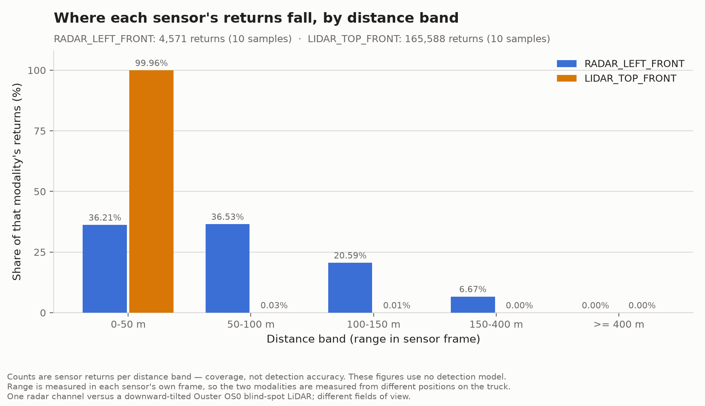
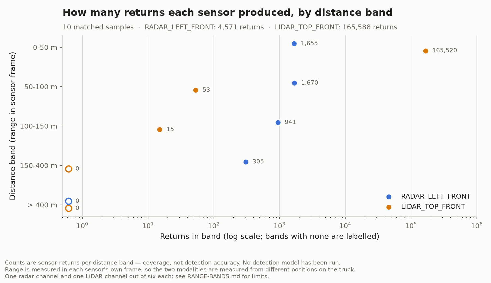

# Matched RADAR/LiDAR range-band coverage

**Owner:** Fatima Sher · **Story:** FA-S3-1 · **Reviewer:** Kelsey Chen

## What this is

[`range-bands.csv`](range-bands.csv) counts how many RADAR and LiDAR returns
fall within each distance band, for every sample in
[`sample-manifest.csv`](sample-manifest.csv) and in total. Produced by
`scripts/truckscenes_range_bands.py`.

One row per sample, modality and band, plus aggregate rows. Every row states
its sample count, modality, channel, band, count, denominator and what that
denominator covers, so a row read on its own still says what it is.

**This measures sensor coverage — how far returns reach — and nothing else.**
It is not object-detection accuracy, and a populated far band is not evidence
that anything can be detected at that distance. No detection model has been
run. The stock TruckScenes v1.2.0 evaluator produces no detection score beyond
150 m at all.

## Bands

Default edges are 0 / 50 / 100 / 150 / 400 m, the set proposed in
`docs/metrics-definitions.md`. **That decision is still open** — see
[`RANGE-BANDS-OPEN-QUESTION.md`](RANGE-BANDS-OPEN-QUESTION.md) — so the edges
are a command-line option, not a constant:

```bash
python scripts/truckscenes_range_bands.py --band-edges 0,25,50,80,100,150
```

An open band above the highest edge is always added. Without it a return past
400 m would belong to no band and vanish from the table while still sitting in
the point cloud. With it, every return lands in exactly one band and the
proportions always cover the whole.

`0` and `no data` mean different things. A band that was measured and held no
returns is a real `0`. A band that could not be measured — the channel was not
present for that sample — reads `no data`, and its sample is excluded from the
`sample_count` of the aggregate row.

## How to regenerate

```bash
# activate the project virtualenv first -- see SETUP.md
export TRUCKSCENES_ROOT=/path/to/man-truckscenes
python scripts/truckscenes_range_bands.py
```

Then confirm nothing moved:

```bash
git status --short
```

No output means the regenerated file is byte-identical to the committed one.
The CSV contains no timestamp or machine detail, so this holds on any machine.

## Result

From the committed CSV, aggregated over all 10 samples in the manifest:

| Modality | 0–50 m | 50–100 m | 100–150 m | 150–400 m | > 400 m | Total returns | Furthest return |
|---|---:|---:|---:|---:|---:|---:|---:|
| RADAR_LEFT_FRONT | 1,655 | 1,670 | 941 | 305 | 0 | 4,571 | 189.46 m |
| LIDAR_TOP_FRONT | 165,520 | 53 | 15 | 0 | 0 | 165,588 | 140.25 m |

Radar returns are spread across the bands out to a furthest return of 189 m.
This LiDAR channel's returns sit almost entirely below 50 m, with a furthest
return of 140 m.

## Figures

`scripts/plot_truckscenes_range_bands.py` plots the committed CSV. It reads the
CSV only — it never opens the dataset and never recomputes a count — so every
value on a figure traces back to a committed number.

```bash
python scripts/plot_truckscenes_range_bands.py
```





Two figures, because the two questions need different scales. The first shows
what **share** of each sensor's returns falls in each band, on one shared
0–100% axis; that is the only fair common scale for a paired comparison here,
since the two sensors produce very different numbers of returns and raw counts
on a shared linear axis would flatten the smaller series onto the baseline. The
second shows the **absolute counts** on a shared logarithmic axis, drawn as
markers rather than bars — a bar encodes magnitude as length from zero, and a
log axis has no meaningful zero, so log bars would misstate every value.

Both figures state the sample count, both channels and both denominators, and
both carry the coverage-not-detection caveat. Bands holding no returns are
drawn as a hollow marker with a `0` label rather than being left blank, so an
empty band cannot be mistaken for a missing measurement.

The figures carry no date or software stamp, so regenerating them **on the
same machine** produces identical files and the repository does not churn.
Unlike the CSVs, they are **not** byte-identical across operating systems:
text is rendered by the host's own font stack, so the same script on macOS
and on Linux produces visually identical figures of different byte length.
Compare figures by regenerating on one machine, and compare the CSVs when
comparing across machines. See
[`ACCEPTANCE-CHECK.md`](ACCEPTANCE-CHECK.md).

## Limits

**The LiDAR channel measured here is a short-range blind-spot sensor.**
This is now established rather than suspected — see
[`sensor-inventory.csv`](sensor-inventory.csv).

TruckScenes carries two LiDAR models: two Hesai Pandar64 rated 200 m at 10%
reflectivity, and four Ouster OS0 rated 35 m. The paper places the Pandar64s
in the two corner modules at roughly 2.2 m, and the Ousters three on the cabin
roof "tilted downwards for blindspot coverage" at roughly 3.2 m plus one at
the trailer rear. The mounting heights in the dataset's own
`calibrated_sensor` table match that split exactly: `LIDAR_LEFT` at 2.191 m
and `LIDAR_RIGHT` at 2.189 m sit in the corner modules beside the cameras and
radars, while `LIDAR_TOP_FRONT`, `LIDAR_TOP_LEFT` and `LIDAR_TOP_RIGHT` sit at
3.23–3.32 m on the roof.

`LIDAR_TOP_FRONT` is therefore a roof Ouster: short range, angled down at the
truck's blind spot. Its returns concentrating below 50 m is that sensor doing
its job, **not** a finding about LiDAR range. **The comparison on this page is
channel-specific and must not be read as a modality-level result.**

The LiDAR to compare against `RADAR_LEFT_FRONT` is **`LIDAR_LEFT`**: the same
corner module, the same side of the truck, a nearly identical origin, and
rated to 200 m rather than 35. Repeating the measurement on that channel is
the next step, and until it is done no radar-versus-LiDAR range claim should
be made from this data.

**One radar of six against one LiDAR of six.** These two channels were chosen
to match the existing Sprint 2 figures and statistics, not because they are
representative. Fields of view differ between channels and are not accounted
for here.

**Ten of 400 annotated samples**, the first of each scene. A declared
development subset, not dataset coverage. Percentages are shares of the
returns in this subset, never of the dataset.

**No shared coordinate frame.** Range is `sqrt(x² + y²)` in each sensor's own
frame, so radar and LiDAR distances are measured from two different physical
positions on the truck. No ego or global transform is applied.

**Point counts are not a quality measure.** LiDAR produced roughly 36 times as
many returns as radar here. That describes sensor density, as recorded in
Sprint 2, and says nothing about detection performance for either modality.

**Weather is not analysed.** The manifest includes every scene without
filtering, and a handful of differently labelled scenes cannot support a
weather claim.
