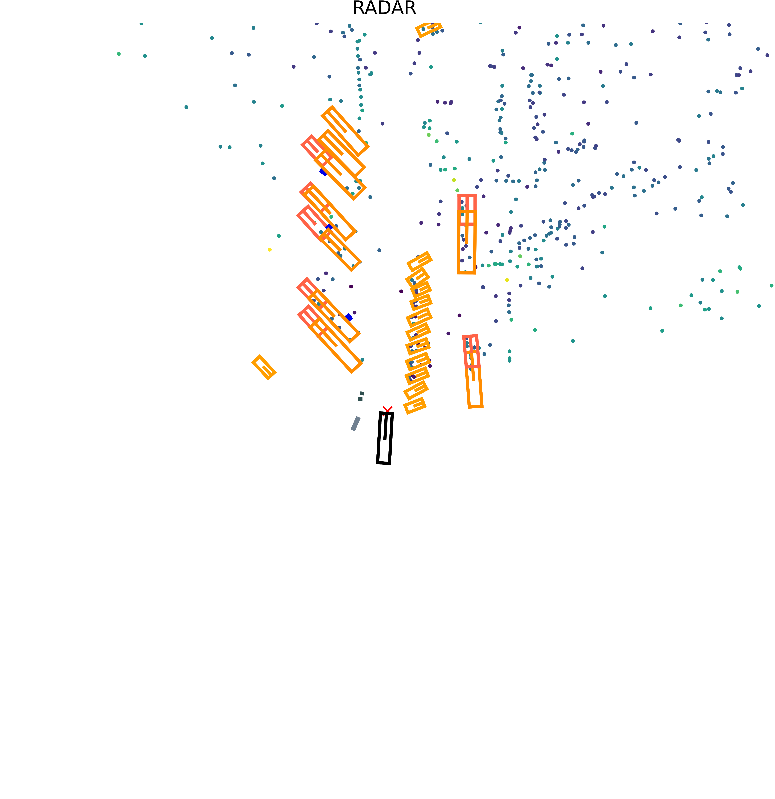
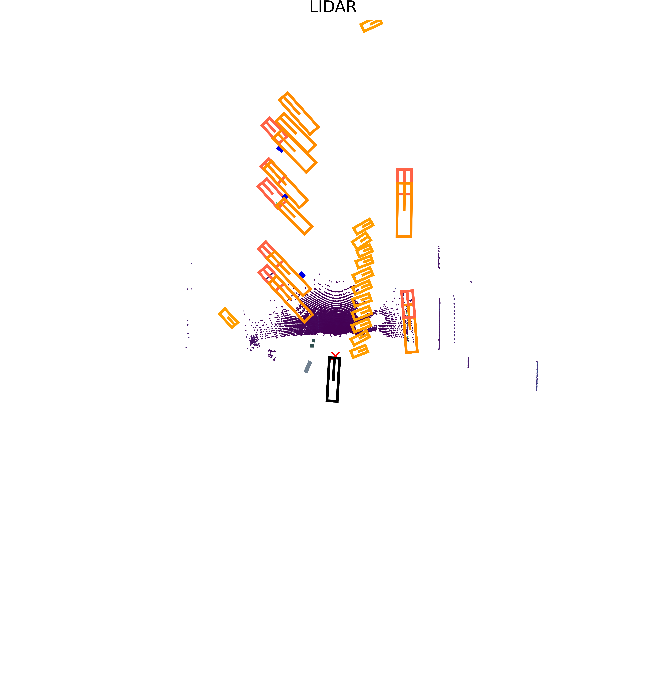

# MAN TruckScenes exploration summary

## Completed

- Installed the official TruckScenes devkit on Apple Silicon macOS.
- Loaded all 10 scenes and 400 annotated samples in `v1.2-mini`.
- Rendered matched `RADAR_LEFT_FRONT` and `LIDAR_TOP_FRONT` samples from every mini scene.
- Measured the dataset inventory, annotation counts and selected-sample point distributions.
- Added configurable dataset paths, supporting tests and structured result records.

## Outcome

Dataset loading, measurement and visualisation worked locally. A Matplotlib compatibility issue in the devkit renderer was identified and handled in the visualisation script. The selected LiDAR samples were much denser than the paired RADAR samples, while the RADAR samples included returns beyond 150 m.

The orange 3D boxes shown by the devkit are dataset ground-truth annotations, not model predictions. Point density and long-range returns are not measures of detection accuracy.

## Sample visualisations

This pair comes from the first annotated sample in scene 1, recorded in clear weather at a terminal. The RADAR view contains fewer, more widely distributed returns, while the corresponding LiDAR view contains a denser geometric point cloud.

### RADAR view

### Corresponding LiDAR view

The coloured/orange 3D boxes shown by the TruckScenes devkit are dataset ground-truth annotations. They are not predictions from an object-detection model.

No object-detection model has been run yet. These images demonstrate successful dataset loading and sensor visualisation only.

## Current limits

No object-detection model has been run. There are therefore no project-produced mAP, precision or recall results. The mini split and the selected samples support feasibility work, not full-dataset benchmark claims.
