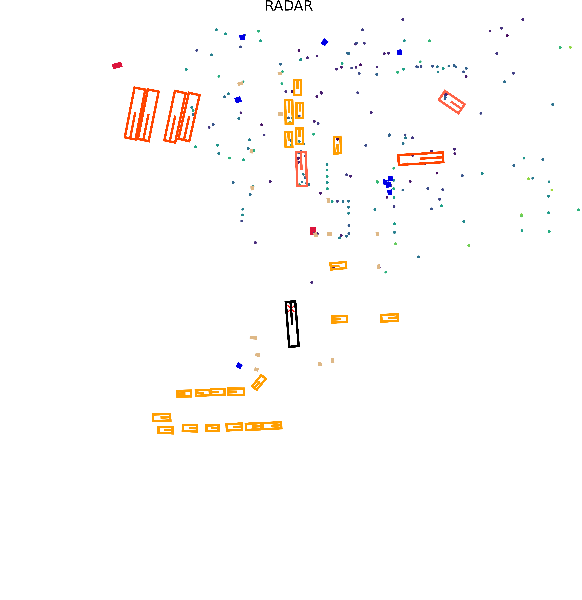
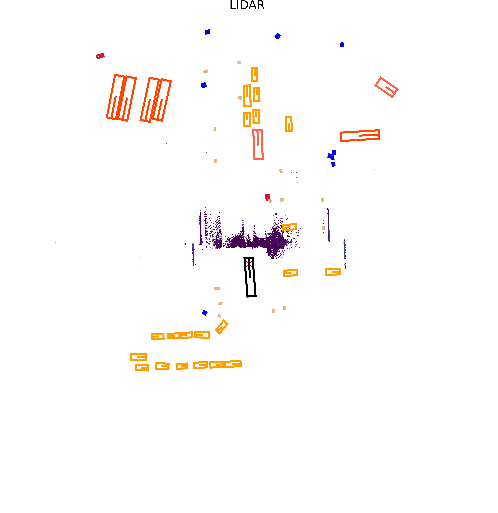
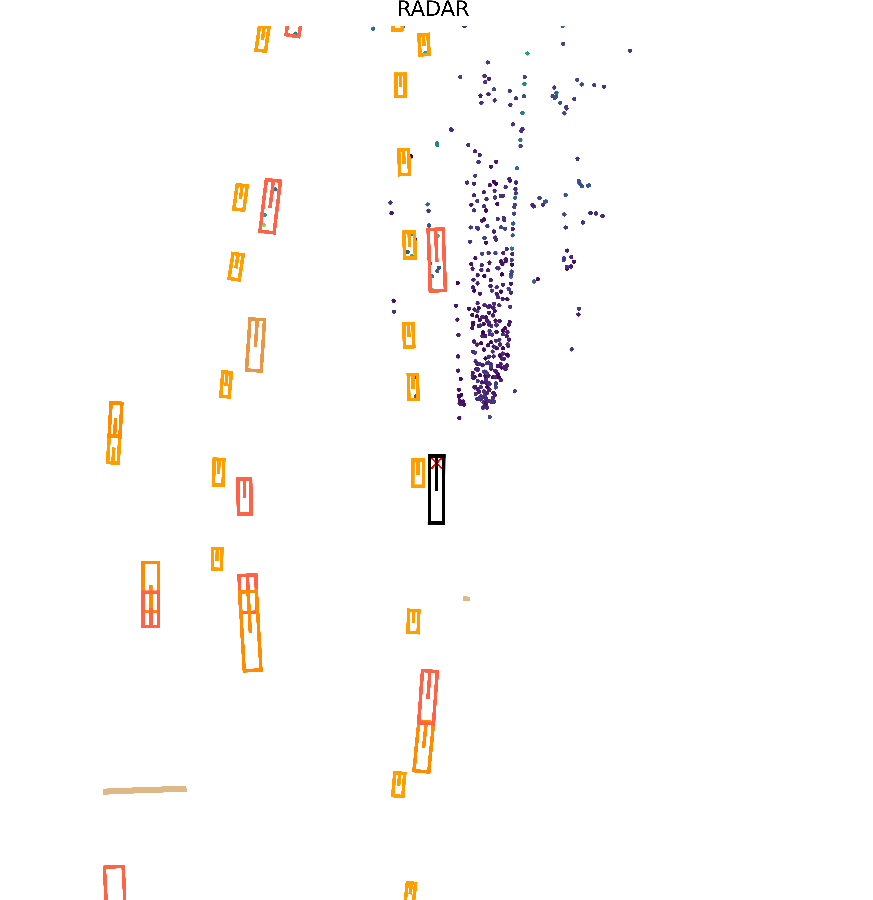
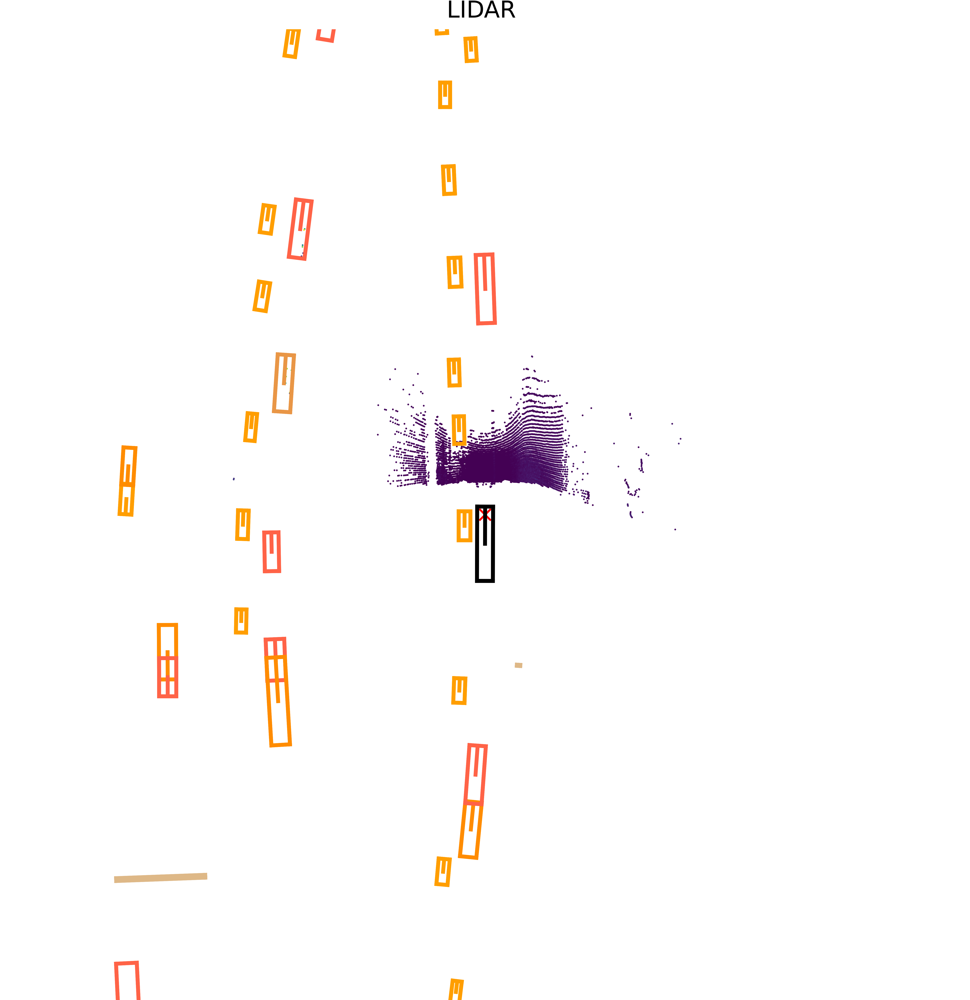

# Fatima's MAN TruckScenes findings

- The official TruckScenes devkit installed successfully on Apple Silicon macOS, and `v1.2-mini` loaded correctly.
- RADAR and LiDAR data could be visualised as matched samples across all 10 mini scenes.
- The devkit expected `matplotlib.cm.get_cmap`, which is unavailable in the installed Matplotlib version. A narrow compatibility mapping allowed rendering to complete.
- The scripts now accept the dataset location at runtime instead of containing a machine-specific path.
- The selected LiDAR samples contain many more points than the selected RADAR samples. This describes sensor density, not detection quality.
- The selected RADAR data includes returns beyond 150 m, making long-range investigation possible at the sensor-data level. This does not prove that objects can be detected accurately at that distance.
- TruckScenes appears suitable for future on-road multimodal and long-range feasibility work. GOOSE remains the project's off-road terrain dataset.

The orange oriented 3D boxes displayed by the devkit are ground-truth annotations supplied with TruckScenes. They are not predictions from an object-detection model.

No object-detection model has been run, and no mAP, precision or recall results have been produced.

## Representative visualisations

The following pairs use the first annotated sample from three scenes. Dataset metadata identifies scene 1 as clear weather at a terminal, scene 8 as snow in a city, and scene 9 as rain on a highway.

The coloured/orange 3D boxes shown by the TruckScenes devkit are dataset ground-truth annotations. They are not predictions from an object-detection model.

No object-detection model has been run yet. These images demonstrate successful dataset loading and sensor visualisation only.

### Clear terminal scene

**RADAR**

**LiDAR**

### Snow city scene

**RADAR**

**LiDAR**

### Rain highway scene

**RADAR**

**LiDAR**

