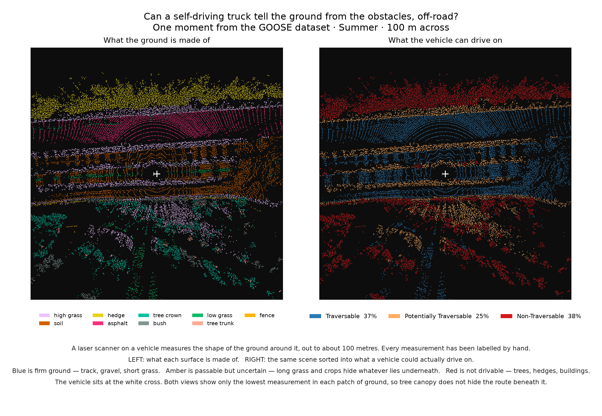

# Client Note — GOOSE closeout and the next comparison (PROPOSED)

> **Do not send yet.** First merge the GOOSE survey correction in PR #25 to reflect
> the bounded PTv3 result. Kelsey or Fatima must then cold-read the figure, the survey
> conclusion and the result-adding instructions. This is the outstanding outside-pair
> acceptance check. Refresh the date below when the note is actually sent.

**From:** Team 07 · **To:** Adrian Boeing and Fabian · **Draft date:** 1 September 2026
**Re:** What GOOSE answered, what it cannot answer, and where the comparison moves next

## What we tested

We tested whether GOOSE is usable for the client's off-road question and whether its
published 3D baseline can run through the public release. We independently set up the
data on macOS and Windows, characterised the full validation split, produced a
traversability interpretation and exercised the published GOOSE Pointcept/PTv3
checkpoint and configuration with a documented compatibility patch.

## What happened

**GOOSE is usable for off-road LiDAR terrain analysis.** We verified 961 labelled
frames containing 174.9 million points and mapped its 64 semantic classes into four
reviewable categories: free/excluded, traversable, potentially traversable and
non-traversable.

The figure is an interpretation of the authors' human ground-truth labels, not a model
prediction. It shows that GOOSE can support the question *“what can I drive over, what
can I crash into?”*, subject to vehicle-specific judgement and a stated projection
method.

**The published GOOSE Pointcept/PTv3 path can execute locally with our documented
runtime patch, but we do not yet have a complete benchmark.** The smallest and largest
validation frames completed in FP32 on the GTX 1660. A full 961-frame attempt produced
10 predictions before we stopped it at Ricky's limit on sustained GPU load. Those
partial values are diagnostics, not a full-split mIoU and not a reproduction of the
published 0.8096 result.

**GOOSE cannot provide a fair radar-versus-LiDAR comparison.** Its labelled benchmark
covers camera/LiDAR semantic segmentation. The vehicle carried radar, but the
downloadable labelled data does not provide equivalent radar ground truth or a
radar-first baseline for the same task. GOOSE is also predominantly short range:
62.9% of labelled points are within 25 m and only 3.8% are beyond 100 m.

## What it means

The GOOSE strand has produced a useful, reproducible outcome:

- off-road LiDAR terrain characterisation and traversability are feasible;
- the public model pipeline is feasible on bounded inputs;
- a complete PTv3 score remains optional;
- GOOSE does not answer the project's central radar-versus-LiDAR question.

A longer local GOOSE run would add a reproduction score, but it would not add radar
evidence. The direct sensor comparison should therefore move to TruckScenes, while
TruckDrive remains the appropriate dataset for the long-range question.

Compute for a complete paired benchmark remains to be agreed. Kaya access is still
pending; the bounded GOOSE run does not establish the resources needed for TruckScenes.

STONE was dropped from the current plan at the 29 August meeting rather than treated
as disproved. Revisit it if usable radar assets, integration code and the
licence/handover blockers change.

## Decision requested

**Please confirm that we should close the current GOOSE investigation after the
outside-pair review, retain the partial PTv3 run as the honest result, and prioritise
the like-for-like radar-versus-LiDAR experiment on TruckScenes.**

If a complete GOOSE PTv3 reproduction is still valuable to you, we will schedule it on
approved remote or deliberately limited compute rather than restarting sustained load
on the local GTX 1660.
