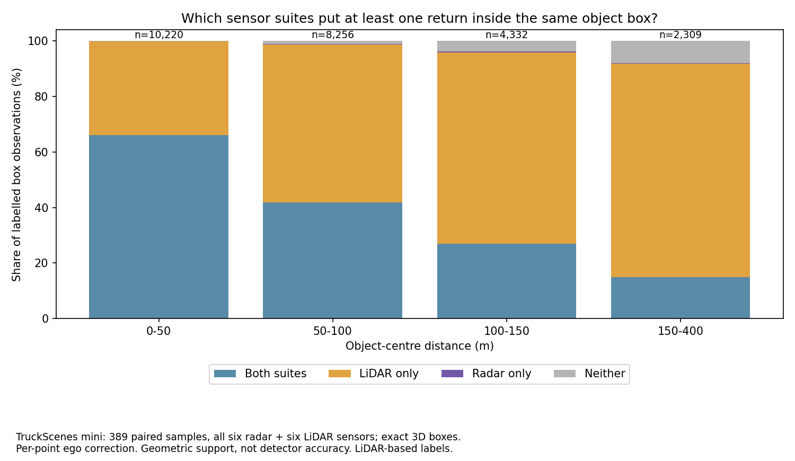
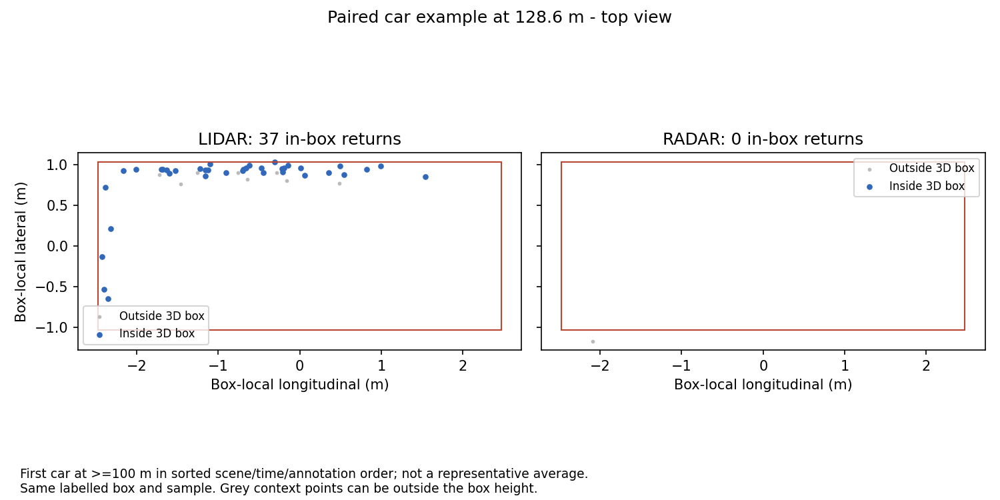

# Radar and LiDAR: what our TruckScenes experiment shows

**26 September off-road extension:** [STONE paired terrain pilot](stone-paired-terrain-pilot.md)
adds measured ground/raised-geometry support from 20 radar/LiDAR frames. It exposes
a radar-calibration ambiguity that must be resolved before a firm terrain ranking.
The [new dataset shortlist](offroad-dataset-next-steps.md) separates independent
off-road and adverse-weather follow-ups.

**24 September follow-up:** [five-scene TruckDrive result](truckdrive-multiscene-result.md) extends the pilot with four additional scenes and reports the qualified 200-400 m vehicle-support conclusion.

**New follow-up:** [TruckDrive paired results to 399 m and the cross-dataset review](long-range-cross-dataset-review.md) supersede the earlier TruckDrive download blocker. This document retains the TruckScenes-specific results.

22 September 2026 · Group 7 · Measured geometric support, not detector accuracy

**Important follow-up:** the [deeper evidence audit](long-range-evidence-audit.md)
found that all recorded radar returns end near **189.52 m from each sensor**.
The LiDAR support advantage persists within 150–180 m and across scene/class/track
checks, but the data does not establish a universal long-range sensor ranking.
The maximum observed labelled object range is **229.42 m**, not 400 m.

**Our current evidence does not justify replacing LiDAR with radar for long-range object coverage.** In the inspected TruckScenes mini data, LiDAR puts returns inside many more of the labelled objects. Radar may still contribute motion information and robustness; those benefits need a separate detector or tracking experiment. The labels were created using LiDAR, so this is a deliberately limited conclusion about this annotation population.

## Results we can present

We read all six radar and all six LiDAR channels, corrected LiDAR points for ego motion using their individual timestamps, and counted returns inside the **same oriented 3D boxes**. The final paired set contains **389 samples, 25,117 box observations and 1,092 tracked instances across ten scenes**. An observation is an object at one time; it is not a distinct object or a successful detection.

| Object-centre distance | Labelled observations | At least one LiDAR return | At least one radar return | Radar present, LiDAR absent |
|---|---:|---:|---:|---:|
| 0–50 m | 10,220 | 99.79% | 66.08% | 5 |
| 50–100 m | 8,256 | 98.74% | 41.91% | 12 |
| 100–150 m | 4,332 | 95.73% | 27.29% | 16 |
| 150–400 m | 2,309 | 91.73% | 15.16% | 6 |

The LiDAR and radar percentage columns overlap; an object can have both. No released box observations in this run had a centre at or beyond 400 m.



**The important long-range result:** radar has at least one in-box return in 350 of 2,309 observations at 150–400 m; only 57 have at least three radar returns. LiDAR has at least one in 2,118 observations. Taking either suite adds six observations to LiDAR's count, increasing geometric support from 91.73% to 91.99%. This is not measured fusion accuracy and does not measure radar velocity quality.

**Class matters:** radar has in-box returns in 1,726/2,163 truck observations (79.80%), 5,730/11,519 car observations (49.74%), 377/977 adult pedestrian observations (38.59%) and 59/836 traffic-cone observations (7.06%). These are pooled descriptive figures: distance, occlusion and scene composition differ between classes. They are not class-specific detector recall or a controlled comparison of reflectivity.

## A concrete engineering finding: alignment changes the answer

On exactly the same 25,117 observations, using one ego pose for each whole LiDAR scan produces **185 apparent radar-only observations**. Correcting individual LiDAR point times reduces that to **39**. LiDAR-supported observations increase from **22,650 to 24,616**. Apparent complementary coverage was therefore strongly affected by preprocessing.

Expanding each box face by 0.5 m reduces the remaining radar-only count to **3** across all distances, and to **0** at 150–400 m. This expansion can admit background points, so it is a sensitivity check, not a more accurate score. The narrow conclusion is that the small radar-only result is sensitive to box boundaries and alignment.

The dataset authors describe motion-compensated LiDAR annotation and residual target-motion effects. We used that guidance to improve our preprocessing. [TruckScenes paper, sections 3.4, 3.6 and A.1](https://arxiv.org/html/2407.07462v2).



This is the first car at least 100 m away in a fixed scene/time/annotation order: **128.6 m, 37 LiDAR returns and no radar returns inside the exact box**. It illustrates what an individual paired observation means; it is not a representative average or a hand-picked best case.

## What remains uncertain

- **Annotation selection:** all included publisher annotations have nonzero published LiDAR counts. Objects absent from these LiDAR-based labels cannot be evaluated here. This analysis cannot establish overall sensor superiority or radar-only object recall.
- **LiDAR count reconciliation:** our raw radar recount matches the publisher for all **25,117** observations. LiDAR counts match exactly for **4,164** observations; the rest differ. Point-wise ego correction improves geometric support but does not reproduce the publisher's full LiDAR aggregation/counting process. The corrected LiDAR figures are our documented recount, not a certified reproduction of publisher counts. Inspecting that remaining difference is a priority before strengthening the comparison claim.
- **Timing:** one of 400 samples fails the existing 50 ms sensor-to-sample gate. Ten more lack continuous poses over the complete LiDAR scan at scene boundaries. All eleven are excluded from both modalities, with tokens and reasons saved. No pose extrapolation crosses a scene gap.
- **Motion and geometry:** ego translation is linearly interpolated and rotation uses quaternion SLERP, with at most a 25 ms pose gap. Observed within-scene gaps reach 20.036 ms. Moving-object and extra cabin-motion correction are not applied. Exact 3D boxes and a 0.5 m margin are reported separately.
- **Scope:** current keyframes, all released classes and full azimuth; no detector predictions, confidence threshold, temporal radar accumulation, weather robustness test or real-time latency measurement. Overlapping sensors can observe the same surface. Repeated observations in ten scenes are not independent statistical trials.

## What this means for the project

1. **Present this measured result now.** Show the distance chart, one paired example, and the alignment finding. Say: "We now have a reproducible paired sensor-support experiment. It does not demonstrate a radar advantage beyond 150 m; it shows why calibration, motion correction and annotation bias matter before evaluating detectors."
2. **Resolve the LiDAR counting difference, then run the matched model experiment.** Use the same held-out TruckScenes samples, task/classes, evaluator and temporal history for radar-only and LiDAR-only models. Report model-plus-modality differences if architectures or training differ. The existing camera results cannot substitute for either model.
3. **Test a specific radar contribution.** Once a compatible model exists, compare radar-only, LiDAR-only and their combination on distant/moving vehicles. Use precision/recall and detection scores, with documented temporal and Doppler treatment. Do not start large training runs or add datasets merely to generate more charts.
4. **Keep the other dataset strands focused.** GOOSE's completed 961-frame analysis describes off-road semantic labels; its earlier partial model run is not a finished benchmark. TruckDrive currently provides saved-data context, not a newly verified raw paired run. Neither supplies a directly comparable sensor accuracy score yet. [Existing dataset findings](sprint3-dataset-findings.md).

### Status of the new online resources

The all-sensor design and motion handling use the TruckScenes paper and the [adverse-weather comparison paper](https://drivex-workshop.github.io/cvpr2026/static/pdf/26_4D_Radar_Meets_LiDAR_and_Ca.pdf). We have not run those papers' trained detectors or weather simulations.

The [official K-Radar model zoo](https://github.com/kaist-avelab/K-Radar/blob/main/docs/labeling.md) lists both LiDAR and radar checkpoints. Both actual public download attempts on 22 September returned **Google Drive quota exceeded**. No checkpoint download or K-Radar inference completed. Its [sample sequence 1](https://github.com/kaist-avelab/K-Radar/blob/main/docs/dataset.md) is listed as **219 GB** on Drive; it was not downloaded. The existing WSL environment has working CUDA PyTorch 2.0.1 and spconv 2.3.6 on a GTX 1660 (6 GB), but model compatibility and memory fit remain untested. More compute alone would not resolve missing compatible models/data.

## Reproduction and evidence

```powershell
python scripts/truckscenes_paired_support.py --data-root <TruckScenes-root> --lidar-motion rigid --output-dir docs/evidence/truckscenes/paired-all-sensor-support
python scripts/truckscenes_paired_support.py --data-root <TruckScenes-root> --lidar-motion point --output-dir docs/evidence/truckscenes/paired-point-motion-support
```

Python 3.11.9; existing TruckScenes devkit 1.2.0 CPU environment. The completed point-corrected pass took approximately **104 seconds** before plotting. This is analysis runtime, not model inference speed or a team member's logged work.

- [Per-object counts](evidence/truckscenes/paired-point-motion-support/object_counts.csv), [range summaries](evidence/truckscenes/paired-point-motion-support/range_support.csv), [class/range summaries](evidence/truckscenes/paired-point-motion-support/class_range_support.csv), [scene/range summaries](evidence/truckscenes/paired-point-motion-support/scene_range_support.csv).
- [Manifest: source hashes, runtime, channels and exclusions](evidence/truckscenes/paired-point-motion-support/manifest.json); [sensor alignment](evidence/truckscenes/paired-point-motion-support/sensor_alignment.csv).
- [Matched preprocessing comparison and verification](evidence/truckscenes/paired-support-verification.json); result record 0016 and [EXP-0013](../experiment-log/0013-paired-truckscenes-support.md).

Geometry agrees with the official devkit on 50 randomized cases. Seven focused raw-runtime tests pass, including rotation, width/length order, exact boundaries, interpolation and gap rejection. The dependency-light full suite passes 167 tests with three optional-runtime tests skipped; those three pass in the raw runtime. Result and experiment-log validators pass.
