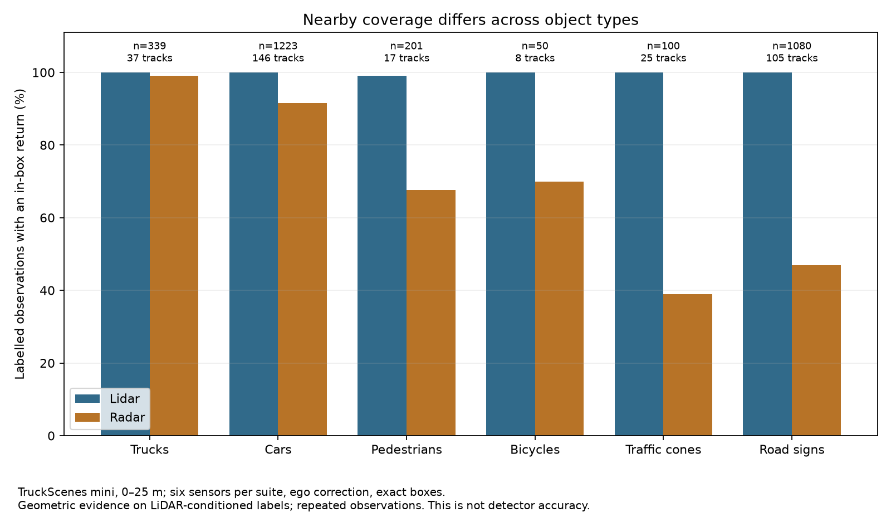
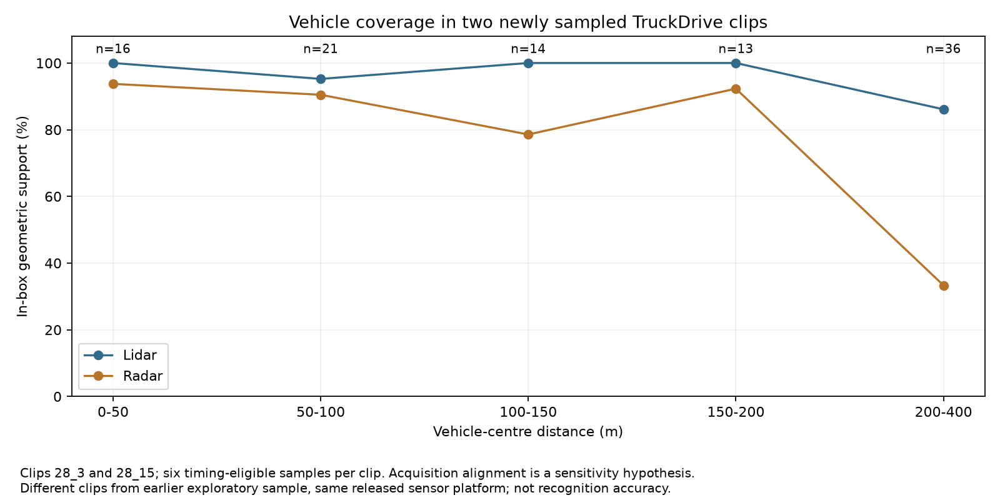
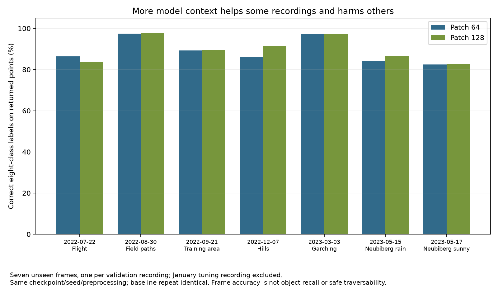

# Twenty plain-language dataset conclusions — 1 October 2026

These conclusions consolidate earlier results and new studies. The new work adds two previously unexamined TruckDrive clips, seven unseen GOOSE frames with controlled model variants, and expanded class/visibility/weather analyses. Findings describe the tested hardware, recordings and model configuration. Coverage means an in-box sensor return; terrain scores measure classification of returned points. Neither is a general detector or safe-driving score.

The client report and planning register remain local. This page is the findings/evidence summary. Individual case findings are explicitly marked; the count does not establish twelve weeks of labour or client acceptance.

## Distance and object types

### C01 — LiDAR gave more complete distant-vehicle coverage in the systems we tested.

**Evidence:** The new TruckDrive clips have 36 vehicle observations at 200–400 m across 18 tracks: LiDAR 86.11%, radar 33.33%. LiDAR leads in both clips, including static/expanded-box sensitivities; the earlier five-clip cohort showed the same pooled ordering.

**Why it matters:** Use LiDAR as the stronger distant-vehicle geometry reference for these configurations.

**Limit:** Two new clips, 12 timing-eligible frames; observations repeat tracks. LiDAR-conditioned annotations and acquisition-alignment hypothesis. Coverage is an in-box return, not recognition accuracy or a universal hardware ranking.

**Status / basis:** Supported within stated scope; New analysis or inference. Sources: [truckdrive_holdout_support.csv](../results/evidence/sprint-followup-oct01/truckdrive_holdout_support.csv); [truckdrive-multiscene-result.md](../docs/truckdrive-multiscene-result.md).

### C02 — Radar coverage of nearby trucks was almost as complete as LiDAR coverage.

**Evidence:** At 0–25 m in TruckScenes, LiDAR support is 100.00% and radar support 99.12%, across 339 observations, 37 tracks and 9 scenes. Equal-track support is 100.00% and 99.53% respectively.

**Why it matters:** Radar is a credible complementary source for large nearby truck targets in this sample.

**Limit:** All six sensors per modality; exact boxes and pointwise ego correction. Repeated observations and LiDAR-conditioned labels. Class/viewpoint/occlusion differences remain; not detector recall or an isolated material/reflectivity effect.

**Status / basis:** Supported within stated scope; Expanded class/track reanalysis of existing paired scans. Sources: [class_range_support.csv](../results/evidence/sprint-followup-oct01/class_range_support.csv).

### C03 — LiDAR covered nearby adult pedestrians more consistently than radar.

**Evidence:** At 0–25 m in TruckScenes, LiDAR support is 99.00% and radar support 67.66%, across 201 observations, 17 tracks and 5 scenes. Equal-track support is 99.44% and 64.49% respectively.

**Why it matters:** Evaluate pedestrian coverage separately from large-vehicle averages.

**Limit:** All six sensors per modality; exact boxes and pointwise ego correction. Repeated observations and LiDAR-conditioned labels. Class/viewpoint/occlusion differences remain; not detector recall or an isolated material/reflectivity effect.

**Status / basis:** Supported within stated scope; Expanded class/track reanalysis of existing paired scans. Sources: [class_range_support.csv](../results/evidence/sprint-followup-oct01/class_range_support.csv).

### C04 — LiDAR covered nearby bicycles more consistently than radar.

**Evidence:** At 0–25 m in TruckScenes, LiDAR support is 100.00% and radar support 70.00%, across 50 observations, 8 tracks and 3 scenes. Equal-track support is 100.00% and 63.14% respectively.

**Why it matters:** Keep cyclists as a separate evaluation group; strong truck results do not establish cyclist coverage.

**Limit:** All six sensors per modality; exact boxes and pointwise ego correction. Repeated observations and LiDAR-conditioned labels. Class/viewpoint/occlusion differences remain; not detector recall or an isolated material/reflectivity effect.

**Status / basis:** Supported within stated scope; Expanded class/track reanalysis of existing paired scans. Sources: [class_range_support.csv](../results/evidence/sprint-followup-oct01/class_range_support.csv).

### C05 — LiDAR covered nearby traffic cones much more consistently than radar.

**Evidence:** At 0–25 m in TruckScenes, LiDAR support is 100.00% and radar support 39.00%, across 100 observations, 25 tracks and 2 scenes. Equal-track support is 100.00% and 45.33% respectively.

**Why it matters:** Include small roadwork obstacles when evaluating perception coverage.

**Limit:** All six sensors per modality; exact boxes and pointwise ego correction. Repeated observations and LiDAR-conditioned labels. Class/viewpoint/occlusion differences remain; not detector recall or an isolated material/reflectivity effect.

**Status / basis:** Supported within stated scope; Expanded class/track reanalysis of existing paired scans. Sources: [class_range_support.csv](../results/evidence/sprint-followup-oct01/class_range_support.csv).

### C06 — LiDAR covered nearby road signs much more consistently than radar.

**Evidence:** At 0–25 m in TruckScenes, LiDAR support is 99.91% and radar support 46.94%, across 1080 observations, 105 tracks and 8 scenes. Equal-track support is 99.94% and 43.46% respectively.

**Why it matters:** Assess signs separately; these returns alone do not establish reading or understanding a sign.

**Limit:** All six sensors per modality; exact boxes and pointwise ego correction. Repeated observations and LiDAR-conditioned labels. Class/viewpoint/occlusion differences remain; not detector recall or an isolated material/reflectivity effect.

**Status / basis:** Supported within stated scope; Expanded class/track reanalysis of existing paired scans. Sources: [class_range_support.csv](../results/evidence/sprint-followup-oct01/class_range_support.csv).

### C07 — Radar coverage of the same car tracks was less consistent at greater distances.

**Evidence:** For 237 matched car tracks in TruckScenes, equal-track radar coverage falls from 79.95% at 0–50 m to 52.46% at 50–100 m; LiDAR changes from 99.81% to 98.55%.

**Why it matters:** Choose operating-range checks using the same targets across distances.

**Limit:** Recorded tracks, not independent trials; changing view, occlusion and motion remain. This is a range association, not a controlled distance-only effect.

**Status / basis:** Supported within stated scope; Consolidated earlier matched-track evidence. Sources: [matched_track_summary.csv](../docs/evidence/missing-support/matched_track_summary.csv).

## Sensor combination and weather

### C08 — Radar sometimes adds object evidence where LiDAR has none.

**Evidence:** In the new distant vehicle sample, one radar-only observation raises geometric union from 86.11% to 88.89%. The earlier distant cohort had 25 radar-only observations. Radar-only cases remain sensitive to alignment and box definitions.

**Why it matters:** Inspect these cases and test fusion before discarding radar based on its average coverage.

**Limit:** Union of sensor support, not added true detector positives. Labels cannot reveal unannotated radar-only objects; repeated observations are not new independently recovered vehicles.

**Status / basis:** Supported within stated scope; New analysis or inference. Sources: [truckdrive_holdout_support.csv](../results/evidence/sprint-followup-oct01/truckdrive_holdout_support.csv); [truckdrive-multiscene-result.md](../docs/truckdrive-multiscene-result.md).

### C09 — Our fog sample suggests radar can provide evidence when LiDAR is sparse.

**Evidence:** At 50–75 m in RADIATE, 9/19 vehicle observations pass a strict local radar-contrast test; 0/19 exact footprints have above-ground LiDAR returns. Expanding footprints and allowing adjacent scans raises LiDAR support to 2/19.

**Why it matters:** Prioritise a matched fog/clear-weather recognition test to assess radar backup.

**Limit:** Tiny radar-annotated fog pilot, four tracks overall, no clear-weather control. Contrast and point presence are different measurements; fog causality and detector superiority are unproven.

**Status / basis:** Suggestive weather pilot; Consolidated earlier weather pilot. Sources: [radiate-fog-pilot.md](../docs/radiate-fog-pilot.md); [observations.csv](../docs/evidence/radiate-fog/observations.csv).

### C10 — LiDAR retained strong car coverage in the sampled rain and snow recordings.

**Evidence:** At 50–100 m, rain car observations have LiDAR 95.62% and radar 42.40% (776 observations, 64 tracks); snow has LiDAR 99.40% and radar 60.84% (498 observations, 32 tracks). Each band uses one recording per weather condition.

**Why it matters:** Evaluate particular hardware and conditions before assuming radar will always have better adverse-weather object coverage.

**Limit:** Descriptive results from different scenes with different targets and LiDAR-conditioned labels. No causal rain/snow penalty, controlled weather comparison or all-weather superiority measured.

**Status / basis:** Supported within stated scope; New analysis or inference. Sources: [weather_support.csv](../results/evidence/sprint-followup-oct01/weather_support.csv).

## Terrain understanding

### C11 — The terrain model can mistake low rock surfaces for ground.

**Evidence:** In the earlier difficult-frame diagnosis, 84.52% of 394 rock points near labelled-ground elevation are called ground, versus 23.46% of 260 higher points. Changing context reduces ground confusion in the three-frame tuning cohort, but correct rock classification reaches only 24.90%.

**Why it matters:** Retain low protruding rocks as explicit failure cases in off-road evaluation.

**Limit:** Nearest-ground height proxy and selected correlated cases; association does not isolate geometry or snow. The new seven-frame cohort has no rock points and does not validate rock generalisation.

**Status / basis:** Supported case finding; Consolidated earlier case-level evidence. Sources: [goose-failure-causes.md](../docs/goose-failure-causes.md); [nearest_ground_diagnostic.csv](../docs/evidence/goose-failure-causes/nearest_ground_diagnostic.csv).

### C12 — Tall grass is a recurring ground-versus-vegetation weakness in the new terrain sample.

**Evidence:** Across all seven selected recordings, 47687/97447 high-grass points (48.94%) are called ground at patch 128; correct vegetation classification is 49.89%. Patch 64 calls 52.06% ground.

**Why it matters:** Treat a ground prediction on tall vegetation as a failure mode to inspect, rather than evidence of a clear route.

**Limit:** Returned-point semantic labels; one selected frame per recording. No height measurement, physical traversability or obstacle detection scored. Correct class is vegetation under the challenge taxonomy.

**Status / basis:** Supported within stated scope; New analysis or inference. Sources: [pooled_class_comparison.csv](../results/evidence/sprint-followup-oct01/terrain/pooled_class_comparison.csv).

### C13 — More context improved the model's classification of poles in the new sample.

**Evidence:** On the same 912 pole points from 3 recordings, correct obstacle-category labels rise from 68.64% at patch 64 to 86.18% at patch 128.

**Why it matters:** Include thin structures when checking a candidate model configuration.

**Limit:** Point-category correctness, not individual-pole recall. A fixed-cohort intervention with the same checkpoint; improvement on these recordings does not establish universal pole performance.

**Status / basis:** Supported within stated scope; New analysis or inference. Sources: [pooled_class_comparison.csv](../results/evidence/sprint-followup-oct01/terrain/pooled_class_comparison.csv); [manifest.json](../results/evidence/sprint-followup-oct01/terrain/manifest.json).

### C14 — Recognising a surface as ground does not mean the model understands its surface type.

**Evidence:** At patch 128, gravel is called ground for 99.82% of 16200 points but correctly called natural ground for 80.07%. Asphalt is called ground for 99.42% of 26593 points but correctly called artificial ground for 89.78%.

**Why it matters:** Keep material-category checks alongside the broad ground/obstacle summary.

**Limit:** Eight-class model taxonomy, not a 64-class material classifier. Four gravel and three asphalt recordings, correlated points; safe driveability is unmeasured.

**Status / basis:** Supported within stated scope; New analysis or inference. Sources: [pooled_class_comparison.csv](../results/evidence/sprint-followup-oct01/terrain/pooled_class_comparison.csv).

### C15 — The terrain model struggled with walls in one newly evaluated recording.

**Evidence:** Only 133/2420 wall points (5.50%) receive the correct artificial-structure category at patch 128; 7.44% are called ground. Building-category points elsewhere in the subset have 90.00% correct structure labels.

**Why it matters:** Inspect separate structure types instead of treating a good building score as coverage of all structures.

**Limit:** One recording with wall points; this is a case finding, not a general wall score or whole-object miss rate. Building and wall point populations differ.

**Status / basis:** Supported case finding; New analysis or inference. Sources: [fine_class_comparison.csv](../results/evidence/sprint-followup-oct01/terrain/fine_class_comparison.csv); [pooled_class_comparison.csv](../results/evidence/sprint-followup-oct01/terrain/pooled_class_comparison.csv).

### C16 — Bicycle surfaces were harder for the terrain model to classify than car surfaces in the inspected recording.

**Evidence:** In the same newly selected rainy recording, correct vehicle-category labels at patch 128 are 133/256 (51.95%) for bicycle points and 19768/20012 (98.78%) for car points.

**Why it matters:** Report vulnerable-road-user categories separately from the overall vehicle score.

**Limit:** One recording and only 256 bicycle points. Point correctness is not bike/car object detection; shape, view and occlusion are not isolated.

**Status / basis:** Supported case finding; New analysis or inference. Sources: [fine_class_comparison.csv](../results/evidence/sprint-followup-oct01/terrain/fine_class_comparison.csv).

## Configuration and generalisation

### C17 — More model context helped most new cases, but made one case worse.

**Evidence:** Patch 128 improves all-point accuracy in 6/7 unseen frames. Pooled eight-class point accuracy rises from 89.54% to 90.81%; the flight frame falls from 86.37% to 83.69%. Baseline repetition is prediction-identical.

**Why it matters:** Treat patch 128 as a candidate with explicit trade-offs; retain regression cases before changing the default.

**Limit:** Seven unseen frames in existing recordings, excluding the tuning recording; not full validation or an external dataset. No new default is adopted. Sampled total GPU memory approached the device limit.

**Status / basis:** Supported within stated scope; New analysis or inference. Sources: [frame_comparison.csv](../results/evidence/sprint-followup-oct01/terrain/frame_comparison.csv); [manifest.json](../results/evidence/sprint-followup-oct01/terrain/manifest.json).

### C18 — Obstacles can still be misclassified even when they are rarely called ground.

**Evidence:** For 4320 points with the generic obstacle label in 2 new recordings, patch 128 correctly assigns the obstacle category to 33.15%; only 3.24% are called ground. Most wrong predictions therefore fall into other categories.

**Why it matters:** Measure correct recognition as well as ground-confusion reduction.

**Limit:** Generic fine-label group and coarse eight-class predictions; two recordings with correlated points. This is not a count of independent obstacles or safe navigation decisions.

**Status / basis:** Supported within stated scope; New analysis or inference. Sources: [pooled_class_comparison.csv](../results/evidence/sprint-followup-oct01/terrain/pooled_class_comparison.csv).

### C19 — A high pooled terrain score can hide serious failures in another environment.

**Evidence:** At patch 128, pooled soil correctness is 99.53% over 51,020 points, dominated by 50,247 field-path points with 100.00% rounded correctness. The rainy recording's 240 soil points have only 7.92% correct natural-ground labels. All 2,401 asphalt points in the flight frame are assigned a wrong coarse category despite 89.78% pooled asphalt correctness.

**Why it matters:** Publish class-by-recording results and inspect failures alongside aggregate scores.

**Limit:** Small class populations in some recordings; one frame per recording. These are scenario-specific observations, not causal effects of rain or a population generalisation estimate.

**Status / basis:** Supported within stated scope; New analysis or inference. Sources: [fine_class_comparison.csv](../results/evidence/sprint-followup-oct01/terrain/fine_class_comparison.csv); [pooled_class_comparison.csv](../results/evidence/sprint-followup-oct01/terrain/pooled_class_comparison.csv).

## Practical feasibility

### C20 — The available model pair cannot yet tell us which sensor recognises distant vehicles better.

**Evidence:** The inspected pretrained LiDAR/radar PointPillars pair accepts inputs only to about 70 m; zero of the earlier 504 vehicle centres at 200–400 m lie in its input region. Official TruckDrive/L-RadSet release documentation was refreshed on 1 October and remains at the same inspected revisions; the reviewed TruckDrive instructions provide a training workflow rather than a compatible pretrained radar/LiDAR pair.

**Why it matters:** Obtain compatible long-range weights and feature definitions before a fair distant-recognition comparison; more GPU memory alone does not resolve the input-range mismatch.

**Limit:** Verified limitation of the inspected releases/checkpoints, not proof no suitable model exists anywhere. No new detector accuracy, training or author contact claimed.

**Status / basis:** Verified feasibility limitation; Refreshed feasibility finding. Sources: [detector-compatibility-decision.md](../docs/detector-compatibility-decision.md); [release-documents.json](../results/evidence/sprint-followup-oct01/models/release-documents.json).

## Supporting figures

