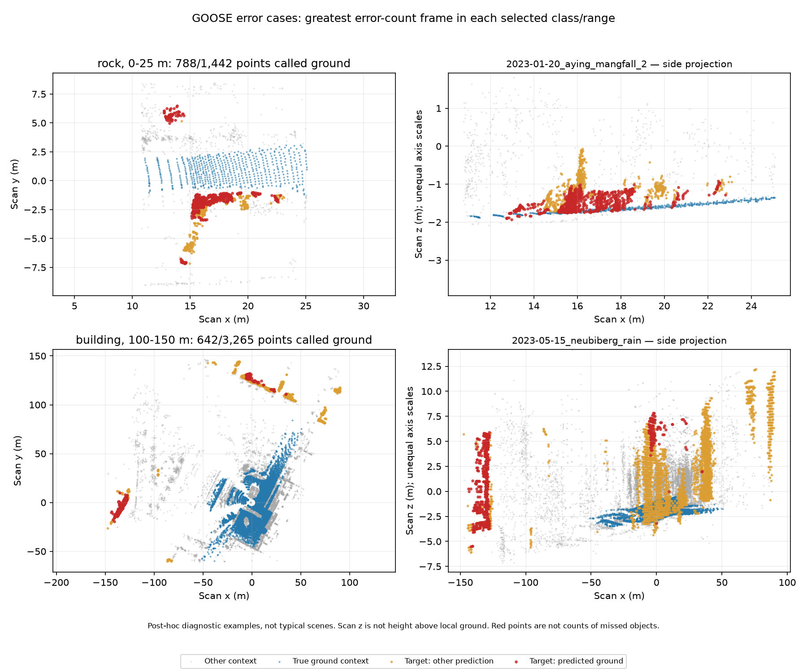

# GOOSE: are we missing many obstacles, or many points on a few obstacles?

28 September 2026 · follow-up to EXP-0027 / result 0032 · existing predictions

**Nearby rock confusion is concentrated in very few observations.** The 40.41%
point-confusion figure from the [24-frame study](goose-multiscenario-terrain.md)
must not be presented as 40% of rocks missed.

We verified the saved prediction/scan/label hashes, then counted fine-class
errors per frame. For rocks, the upper 16 bits of the original labels provide
instance IDs; these were counted within each frame, without treating matching
IDs across frames as distinct or shared physical objects. Buildings have no
instance annotations in this taxonomy.

| Target and range | Frames containing points | Scenarios | Points called ground | Share of those errors from the worst frame |
|---|---:|---:|---:|---:|
| Rock, 0–25 m | 3 | 2 | 813 / 2,012 | 96.92% |
| Rock, 100–150 m | 1 | 1 | 6 / 6 | 100%; too sparse to interpret |
| Building, 0–25 m | 7 | 3 | 11,584 / 91,660 | 98.75% |
| Building, 100–150 m | 8 | 4 | 1,317 / 7,067 | 48.75% |

## Nearby rocks

There are only **seven frame-local rock instance observations** across the
three near-range frames, with no unassigned instance IDs in this subset.
The frame `2023-01-20_aying_mangfall_2__0497_1674223778204567633_vls128.bin`
contains three labelled rock instances and contributes **788 of 813** ground
errors. Within that frame:

| Frame-local instance ID | Returned rock points | Points called ground |
|---|---:|---:|
| 78 | 67 | 66 |
| 79 | 1,331 | 705 |
| 80 | 44 | 17 |

Instance 79 alone contributes 86.72% of all nearby rock-to-ground errors. The
other two frames together contain 570 rock points with 25 ground predictions
(4.39%). This is a post-hoc concentration check, not a reason to remove the
difficult frame or substitute the lower score.

This identifies a genuine classification failure on a labelled rock instance,
but not a missed-object count: no object-matching rule, instance detector or
planning policy was evaluated. Some returns on the same rock are assigned
other classes. We cannot infer that a vehicle would collide with it.

## Buildings and scene dependence

That same January frame contributes **11,439 of 11,584 nearby building-to-ground
errors**. Removing it would leave only 145 errors over 49,379 nearby building
points (0.29%), again demonstrating concentration rather than justifying its
exclusion. It is a priority scene for inspecting model/domain behaviour, not
evidence that range alone explains the error.

At 100–150 m the worst frame is instead
`2023-05-15_neubiberg_rain__0677_1684158156457472801_vls128.bin`, with 642 building
points called ground out of 3,265 building points. These errors contribute
48.75% of the distant building total. Scenario names do not establish weather
as the cause; there is no matched controlled-weather experiment.



The illustrations select the largest error-count frame for nearby rocks and
distant buildings **after scoring**. Red marks true rock/building points
predicted as ground; orange marks other predictions on those same target labels.
Blue shows labelled ground context. Top views use equal axes; side projections
use different horizontal/vertical scales for readability. Scan z is not height
above a fitted local ground surface.

In the selected rock side projection, many red returns lie near the elevation
of surrounding ground while some higher returns receive other predictions.
This is a visual observation consistent with a difficult ground boundary,
**not proof of a height-based failure mechanism**: the points are at different
lateral positions and local ground height has not been estimated. For the
building case, projected points can overlap; a 2D plot cannot establish which
wall/surface is responsible. Camera views or validated local geometry would
help distinguish low geometry, label boundaries and model errors.

## Client interpretation and next step

We can show a concrete example where LiDAR returns exist on a labelled obstacle
but the model calls those returns ground. **Good sensor support does not guarantee
correct classification.** We now know the exact frames and instances to inspect,
instead of presenting a point percentage as a percentage of missed objects.

The useful next work is a focused comparison of this difficult January frame
with nearby frames and camera/ground geometry, retaining the original errors.
Further distant-rock percentages are not useful until more than one six-point
observation is available. This remains a LiDAR-only diagnostic; STONE needs its
physical radar calibration before a defensible paired terrain model comparison.

## Evidence and reproduction

- [Per-frame class counts](evidence/goose-error-cases/frame_class_errors.csv)
- [Frame-local rock instances](evidence/goose-error-cases/rock_frame_instances.csv)
- [Summary](evidence/goose-error-cases/summary.csv) and [manifest](evidence/goose-error-cases/manifest.json)

```text
python scripts/inspect_goose_error_cases.py --root <GOOSE-root> --predictions <ptv3-stratified24-run>/result --mapping <challenge_label_mapping.csv>
```

No new inference or downloads. Original hashes must match the verified 24-frame
manifest. Credit: [GOOSE dataset authors](https://goose-dataset.de/) and published
PTv3 challenge checkpoint. Figure derived from GOOSE data, CC BY-SA 4.0.
