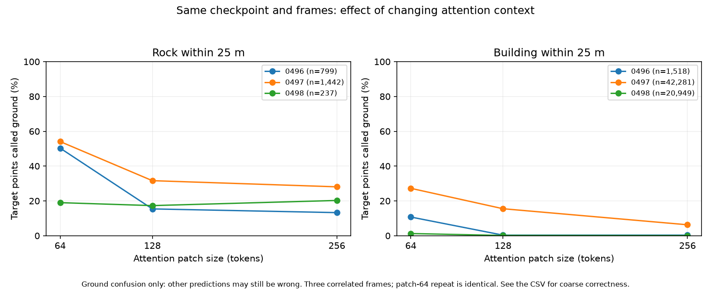

# Why were rocks and buildings labelled as ground?

28 September 2026 · EXP-0028 · result 0033 · three-frame diagnostic intervention

**A confirmed contributor is the small attention context in our hardware-compatible
PTv3 inference setup.** Keeping the checkpoint, raw frames, seed and preprocessing
fixed, increasing attention patch size from 64 to 128 and 256 substantially reduces
ground-category confusion. Low rock surfaces are also associated with ground errors,
but geometry and visible snow have not been isolated as causal factors.

This is a model/configuration result on three deliberately selected neighbouring
frames, not a general LiDAR-versus-radar result or an independent benchmark.
The earlier [24-frame study](goose-multiscenario-terrain.md) remains a measurement
of the patch-64 configuration; do not silently replace its numbers with these.

## Controlled context experiment

We evaluated frames 0496, 0497 and 0498 from `2023-01-20_aying_mangfall_2`:
**644,654 labelled points**, with 2,478 nearby rock points and 64,748 nearby
building points. These are adjacent views of the same scene, not independent
environments. Their released timestamps span approximately 8.08 seconds.

The same published checkpoint (epoch 33), source commit, FP32, FlashAttention-off,
single augmentation and seed 20260831 were used throughout. The saved configurations
differ only in output path and encoder/decoder attention patch sizes. A second
fresh patch-64 run produces **identical predictions for every point in all three
frames**. No cached predictions were reused.

| Measurement on these three frames | Patch 64 | Patch 128 | Patch 256 |
|---|---:|---:|---:|
| Nearby rock points incorrectly called ground | 49.52% | 25.02% | 22.56% |
| Nearby building points incorrectly called ground | 18.43% | 10.18% | 4.12% |
| Rock points assigned their correct coarse category | 18.12% | 24.82% | 24.90% |
| Building points assigned their correct coarse category | 62.53% | 73.02% | 80.71% |
| All-point eight-class accuracy, including other | 90.38% | 92.33% | 93.63% |



For the originally flagged frame 0497, nearby rock-to-ground errors fall from
780/1,442 to 405/1,442 points, and building-to-ground errors from 11,513/42,281
to 2,656/42,281. The original 24-frame run had slightly different counts (788 and
11,439): changing the subset/frame order changes the random preprocessing state.
The comparison above therefore uses a fresh, fixed-order baseline and verifies
its repeat instead of attributing that small sampling difference to patch size.

**Larger context is not a complete fix.** In frame 0498, rock-to-ground errors are
45, 41 and 48 at patches 64, 128 and 256 respectively; none of its 237 rock points
receives the correct obstacle category at any setting. In frame 0496, correctly
categorised rock points fall from 94 to 45 to 35 even though ground confusion
falls. Some errors change into other wrong labels. The pooled rock correctness
improvement does not mean every rock or frame improves.

The supplied GOOSE configuration uses attention patches of **1024**, while our
GTX-1660-compatible run reduced them to 64. The official
[PTv3 implementation guidance](https://github.com/Pointcept/PointTransformerV3)
also describes reducing patch size when disabling FlashAttention. A patch is a
group of feature tokens the model attends over, **not a fixed metre-radius**.
Increasing it changes available context; it is not an increase in LiDAR resolution.
The default 1024 setting was not tested here. Patch 256 completed on this machine,
but sampled GPU usage approached 5,900 MiB of 6,144 MiB and its first fragment was slow;
it is not yet a validated full-split operating setting.

## Scene and geometry evidence

We fetched the three matching original camera images from the
[official GOOSE 2D validation release](https://goose-dataset.de/docs/setup/),
using approximately 13.5 MB of verified ZIP ranges rather than downloading
the whole 2.86 GB archive. All PNGs decode at 2048×1000; archive CRCs and SHA-256
hashes were checked. Frame IDs and exported timestamps match the LiDAR filenames.
The [camera manifest](evidence/goose-failure-causes/camera_manifest.json) records
exact filenames and source. Original images remain on F:, outside Git.

The views show a paved road, low roadside rock structures with snow, vegetation
and nearby buildings/sheds. This establishes scene context, **not that snow caused
the model errors**. The evaluated model only received LiDAR coordinates and intensity,
not these images. We did not project individual LiDAR points onto the camera using
validated extrinsics, so individual red points cannot be assigned to a photographed
surface from these images alone.

For the original frame's rock points, we compared raw vertical position with the
nearest labelled ground point in XY. Where that reference lies within one metre:

| Vertical difference from nearest labelled ground | Rock points | Points called ground |
|---|---:|---:|
| Within ±0.2 m | 171 | 164 (95.91%) |
| 0.2–0.5 m above | 142 | 96 (67.61%) |
| 0.5–1 m above | 30 | 8 (26.67%) |

Only **343/1,442 rock points** meet that strict ground-reference proximity rule.
Allowing labelled ground cover (including snow/grass) as reference increases
coverage: 84.52% of 394 points within ±0.2 m are called ground, versus 23.46% of
260 points at 0.5–1 m. The same qualitative pattern survives a two-metre proximity
threshold. These are nearest-point vertical differences, **not validated object
heights**: slopes, lateral separation and cover thickness can affect them.

Local surface-normal diagnostics are also consistent with ground confusion on
low or non-vertical surfaces. Of 612 locally planar rock points called ground,
126 have near-horizontal normals and 30 near-vertical normals. For buildings,
only five of 8,405 eligible points called ground are near-vertical. However,
many building points receiving other predictions are also horizontal; flatness
alone does not explain their errors. Most misclassified building points lack a
nearby labelled-ground reference, preventing a defensible low-height explanation
for the building errors. All unresolved points are retained in the CSVs.

## Processing explanations checked

- The fine-to-eight-class mapping agrees exactly with the challenge labels used
  for inference. Rock maps to obstacle; building maps to artificial structures.
- Raw scan, label and prediction hashes match the preceding evidence. The loader
  uses XYZI and the tester expands predictions back through the saved inverse
  voxel mapping; no coordinate centring transform is active in this test config.
- **No nearby rock/building point shares a 2.5 cm or 5 cm voxel with a ground or
  ground-cover reference point** in the difficult frame. Thus simple merging of
  those labels in these input voxel cells does not explain the ground errors.
  This does not exclude every form of model downsampling or information loss.
- The patch-64 prediction-identical repeat rules out run-to-run variation for the
  controlled baseline. Label quality has not been independently re-annotated;
  camera inspection alone does not prove every 3D label is correct.

## Conclusion and next decision

The strongest explanation we can support is **limited model context interacting
with difficult local geometry**. Context is supported by intervention; the rock
geometry relationship is observational. Snow/domain effects and exact building
surface mechanisms remain hypotheses. These are classification failures despite
recorded LiDAR returns, not proof the sensor cannot see the obstacle.

Before changing the default or promising better obstacle detection, evaluate a
larger-context candidate on separate scenarios and report both ground-confusion
and correct-category rates. Patch 128 is a practical candidate; 256 needs a memory
and timing check on larger frames. Retain the difficult cases, and do not tune or
claim an independent benchmark on these three selected diagnostic frames.

## Reproduction

CPU geometry analysis uses the existing isolated `requirements-stone.txt`
environment (SciPy is optional for the lightweight CI suite). No new dependency
was added to CI or the model environment.

In WSL, create the diagnostic subset:

```text
python scripts/prepare_goose_subset.py --root <GOOSE-root> --output <new-case-root> --center-frame 2023-01-20_aying_mangfall_2__0497_1674223778204567633_vls128.bin
```

Use the [EXP-0027 inference command](goose-multiscenario-terrain.md#method-and-execution)
with this subset, patch sizes 64/128/256, and fresh output directories. Repeat
64 in another fresh directory. The comparator expects names
`goose_case3_p64_20260928`, `goose_case3_p64repeat_20260928`,
`goose_case3_p128_20260928`, `goose_case3_p256_20260928` under the run root.
Copy the subset's selection manifest into `docs/evidence/goose-failure-causes/`.

```text
python scripts/compare_goose_context.py --root <GOOSE-root> --runs <run-root> --mapping <challenge_label_mapping.csv> --checkpoint <challenge_ptv3.pth> --include-p256
python scripts/diagnose_goose_geometry.py --root <GOOSE-root> --predictions <original-stratified24-run>/result --mapping <challenge_label_mapping.csv>
python scripts/acquire_goose_case_images.py --selection docs/evidence/goose-failure-causes/selection.json --output <camera-output>
```

[Per-frame results](evidence/goose-failure-causes/context_comparison.csv),
[pooled counts](evidence/goose-failure-causes/context_pooled.csv),
[run hashes](evidence/goose-failure-causes/context_manifest.json),
[ground-reference sensitivity](evidence/goose-failure-causes/nearest_ground_diagnostic.csv),
[local normals](evidence/goose-failure-causes/normal_diagnostic.csv),
[voxel ambiguity](evidence/goose-failure-causes/voxel_ambiguity.csv).

Credit: GOOSE dataset authors (CC BY-SA 4.0), published challenge PTv3 checkpoint
and Pointcept implementation. No retraining or package changes; all four bounded
GPU runs completed and released their GPU memory.
