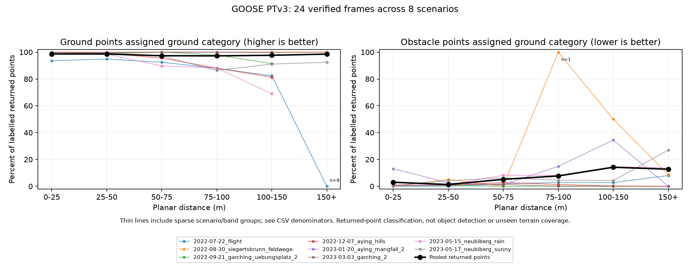

# GOOSE: what gets mistaken for ground across eight scenarios?

28 September 2026 · EXP-0027 · result 0032 · LiDAR-only model diagnostic

**We completed fresh PTv3 inference on 24 frames (4,192,081 points), with three
preselected frames from each of all eight base-validation scenarios.** This
extends the earlier ten consecutive frames from one scenario. It is a separate
subset, not a completed 961-frame benchmark or a radar comparison.

The broader sample changes our interpretation: **the earlier large pooled drop
in distant ground recognition is not robust across these scenarios.** Ground
classification varies by scene and the point-weighted average hides that variation.
Obstacle-labelled points confused with ground remain a concern, particularly
building points at distance. Distance, class mix, visibility and scene composition
are entangled; this is not a controlled causal test of range.

## Range results

These are percentages of *labelled LiDAR points that already exist*. They are
not the percentage of physical ground observed or complete objects detected.
The model's eight classes are regrouped into ground, obstacle, vegetation and
other using the [unchanged semantic partition](offroad-ground-and-obstacles.md).
Ground does not mean safe to drive on, and obstacle candidates need not block
the vehicle's path. Ground cover and ambiguous geometry remain separate.

| Planar distance | Ground points assigned ground | Ground denominator | Obstacle points assigned ground | Obstacle denominator |
|---|---:|---:|---:|---:|
| 0–25 m | 98.63% | 193,698 | 2.99% | 508,645 |
| 25–50 m | 98.63% | 82,064 | 1.29% | 180,512 |
| 50–75 m | 97.33% | 16,525 | 5.16% | 36,696 |
| 75–100 m | 97.24% | 5,333 | 7.69% | 24,091 |
| 100–150 m | 97.67% | 4,888 | 14.17% | 10,173 |
| 150+ m | 98.54% | 1,095 | 12.72% | 3,295 |



At 100–150 m, **4,159 of 4,888 ground points (85.1%) come from one scenario**,
`2022-08-30_siegertsbrunn_feldwege`, which achieves 99.62% ground-category
correctness. Giving each contributing scenario equal weight gives **89.34%**,
versus the pooled 97.67%. Individual scenario values span 68.97–100%, but some
have only 4, 20 or 29 ground points. Equal weighting is a descriptive sensitivity,
not a cure for sparse sampling or a population estimate.

Beyond 150 m, ground exists in only six selected frames from four scenarios.
The 0% scenario endpoint in the figure contains **nine ground points**. Neither
that endpoint nor the pooled 98.54% supports a general long-range terrain claim.
See [range denominators and scenario spread](evidence/goose-stratified/ground/range_summary.csv).

## What is actually confused?

At 100–150 m, 1,442 obstacle-candidate points receive ground predictions:
**1,317 are building points (91.3% of these errors)**. The remainder includes
29 tree-trunk, 23 generic-obstacle, 21 car, 13 pole, 13 barrier-tape, 12 fence,
six rock and eight other points. They are points, not counts of buildings/cars.
Another **31.91%** of obstacle-candidate points receive vegetation predictions;
only 53.92% receive an obstacle-category prediction. A ground-confusion rate
alone is therefore not total obstacle error or recall. **Some vegetation
predictions are correct under the official challenge taxonomy:** tree trunks
map to vegetation, although our physical-obstacle proxy includes them as
obstacle candidates. The 31.91% must not be called a model error rate; this
diagnostic intentionally asks a different question from eight-class correctness.

| True fine label | Called ground at 0–25 m | Called ground at 100–150 m |
|---|---:|---:|
| Building | 11,584 / 91,660 (12.64%) | 1,317 / 7,067 (18.64%) |
| Car | 283 / 50,645 (0.56%) | 21 / 372 (5.65%) |
| Tree trunk | 2,027 / 275,380 (0.74%) | 29 / 1,656 (1.75%) |
| Rock | 813 / 2,012 (40.41%) | 6 / 6 — too sparse to interpret |

The near-range rock confusion is worth investigating before making any claim
about reliable obstacle handling. It does not mean 40% of individual rocks were
missed: these may be correlated returns from very few objects. The fine labels
are diagnostic groupings; the model was not trained as a 64-class rock detector.

For true ground at 100–150 m, 112 points become vegetation and two become
vehicle predictions. The earlier ten-frame report's 65.20% ground result remains
valid for its original subset, but should not be used as the general GOOSE score.
No new model, retraining, tuning or checkpoint change explains the difference:
we changed the evaluated sample.

[All fine-label ground rates](evidence/goose-stratified/ground/class_ground_predictions.csv),
[error counts](evidence/goose-stratified/ground/ground_category_mistakes.csv),
[per-scenario counts](evidence/goose-stratified/ground/scenario_group_confusion.csv)
and [per-frame counts](evidence/goose-stratified/ground/saved_frame_group_confusion.csv)
retain the details and denominators.

## Method and execution

- Selection: sort scans within each scenario, take indices `floor(k*N/4)` for
  `k=1,2,3`, before inference. No label, prediction or score informed selection.
  [Selection manifest](evidence/goose-stratified/selection.json) includes hashes.
- Same published challenge PTv3 checkpoint (epoch 33), Pointcept revision
  `92f91ccedba88bda72d1727d6f5212efd0351414`, documented compatibility patch,
  seed 20260831, FP32, FlashAttention off, patch sizes 64 and one augmentation.
  See [runtime evidence](evidence/goose-stratified/runtime.json).
- Completed on the existing GTX 1660 / WSL environment. Evaluation log runs from
  08:26:54 to 08:32:52 AWST and contains `End Evaluation`; process exited 0.
  Sampled GPU readings reached 80°C and approximately 5.8 GB including other
  desktop workloads, not isolated model peak measurements. GPU memory returned
  below 1 GB after completion. No package installation or training was needed.
- The initial launch lacked `PYTHONPATH`; setting it to the existing source
  checkout resolved the import failure before inference started.
- Scoring verifies the complete selected frame set, raw/challenge label mapping,
  prediction shape/type and SHA-256 inputs. Per-scenario and per-frame counts
  must sum to the pooled counts. Points and nearby frames are correlated.

Reproduce in WSL using the existing runtime from [EXP-0004](../experiment-log/0004-goose-ptv3-partial-validation.md):

```bash
python scripts/prepare_goose_subset.py --root <GOOSE-root> --output <new-subset-root>
# In the Pointcept source checkout, with its environment active:
export PYTHONPATH="$PWD"
python tools/test.py --config-file configs/goose/semseg-pt-v3m1-0-base.py --num-gpus 1 \
  --options weight=<challenge_ptv3.pth> seed=20260831 enable_amp=false \
  model.backbone.enable_flash=false model.backbone.enc_patch_size='[64,64,64,64,64]' \
  model.backbone.dec_patch_size='[64,64,64,64]' data.test.split=val \
  data.test.test_cfg.aug_transform='[[]]' data.test.data_root=<new-subset-root> save_path=<new-run>
```

Back in this repository, copy the subset's `selection.json` into the evidence
directory and run:

```text
python scripts/analyse_goose_saved_errors.py --root <GOOSE-root> --predictions <new-run>/result --mapping <challenge_label_mapping.csv> --selection docs/evidence/goose-stratified/selection.json --output-dir docs/evidence/goose-stratified/semantic
python scripts/analyse_offroad_ground.py --root <GOOSE-root> --predictions <new-run>/result --mapping <challenge_label_mapping.csv> --verified-manifest docs/evidence/goose-stratified/semantic/manifest.json --output-dir docs/evidence/goose-stratified/ground
python scripts/summarise_goose_terrain.py
```

## What to do next

1. Inspect nearby rock and distant building confusions using raw labels and
   prediction overlays; distinguish low geometry, ground-contact boundaries,
   taxonomy effects and correlated instances before calling them missed obstacles.
2. Expand the sample if client decisions require stable scenario/class estimates.
   The present run measures model errors, but not individual-obstacle detection.
3. For a paired radar result, obtain STONE's numerical radar extrinsics described
   in its paper. The [calibration audit](stone-environments-followup.md#calibration-source-audit-28-september-follow-up)
   narrows the missing input; its conditional surface-support results remain valid
   only under their disclosed assumptions. GOOSE and STONE currently measure
   different tasks and should not share one accuracy ranking.

Holes/drop-offs remain unevaluated. An absent return or a ground-category
prediction cannot establish free space, a hole, or driving safety.

Credit: [GOOSE dataset authors](https://goose-dataset.de/), published challenge
checkpoint and Pointcept implementation. Data-derived illustrations are under
GOOSE's CC BY-SA 4.0 terms; raw scans and model assets remain outside Git.
