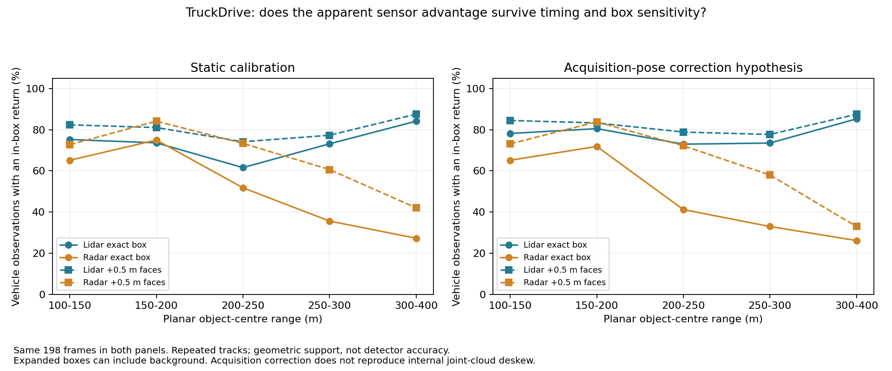
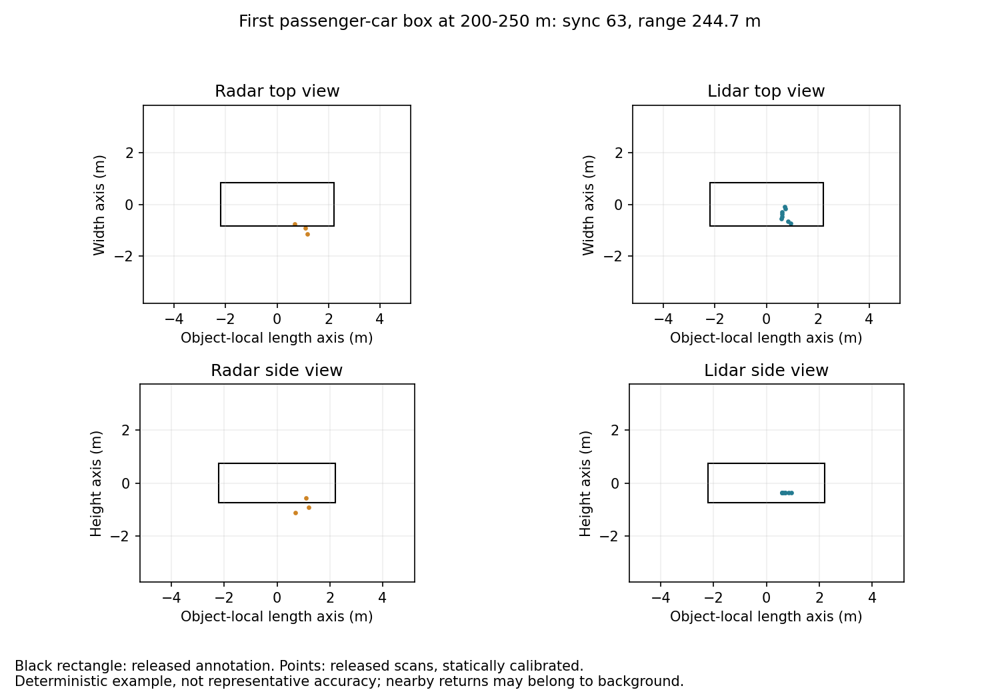
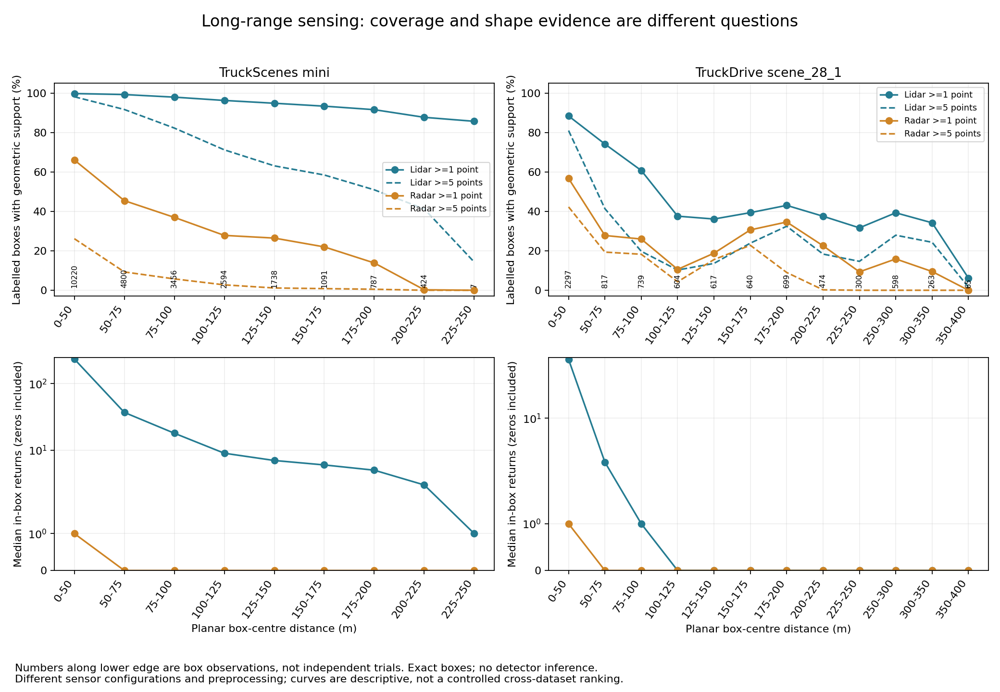

# Radar versus LiDAR at long range: what the evidence can answer

22 September 2026 · Group 7 · Follow-up to the [TruckScenes audit](long-range-evidence-audit.md)

**There is no single long-range winner established by our evidence.** A sensor can return a signal from a distant vehicle while providing too little spatial detail for a model to estimate its shape accurately. Conversely, a sensor can provide detailed geometry when it sees an object, but fail under a different recording configuration or environment. We need to measure these separately.

## The questions we should actually test

| Question | Useful measurement | What it cannot establish alone |
|---|---|---|
| Does the recording contain distant returns? | Observed range distribution and acquisition limits | Whether a return is a real vehicle or a false return |
| Is there evidence at an annotated object? | Paired in-box support, point-count distribution, box-margin sensitivity | Detector precision or recall; unlabelled objects remain untested |
| Can the system identify and localise the object? | Held-out detector precision/recall and AP by distance and class | A pure sensor effect if model/training/temporal history differ |
| Is the evidence stable enough for driving? | Track continuity, position/velocity error, latency and weather-specific tests | General safety from one scene or one average score |

We have measured the first two questions. We have not completed the matched-model experiment needed for the third, or a validated tracking experiment for the fourth. A box observation is one object at one time, and repeated observations are correlated.

## New paired measurements beyond TruckScenes

The official TruckDrive repository now links a reachable mini-data portal. We downloaded the complete calibration, pose, annotation, joint-radar and LiDAR archives for **scene_28_1**, retaining the licence and notice locally. All downloaded archives passed ZIP CRC checks and have recorded SHA-256 hashes. Camera and depth archives were unnecessary for this geometric comparison.

We processed **200 same-sync annotated frames and 8,113 valid non-ego 3D object observations**, with box centres reaching **399.03 m**. We excluded 5,220 annotations without valid 3D geometry and 400 ego-vehicle annotations. These exclusions prevent placeholder coordinates from appearing as spurious kilometre-range objects. All five calibration transforms independently match the publisher's helper functions.

Across the paired frames, the released radar clouds contain **2,828 returns at >=300 m**, reaching **328.01 m** in the common frame. LiDAR contains **21,055 returns at >=300 m**, reaching **398.78 m**. These are observed planar ranges, not sensor specifications or verified true-positive detections. They independently demonstrate why TruckScenes' 189.52 m radar boundary must not be generalised.

### Vehicle evidence across five distance bands

The following table uses the **acquisition-time ego correction sensitivity run**, with the same 198 frames available to both sensors. The first and last frames are excluded from both modalities because their scan times require pose extrapolation. We count a return inside the released oriented box; five-point support is a separate density diagnostic, not a definition of successful detection.

| Vehicle distance | Box observations / distinct tracks | LiDAR >=1 point | Radar >=1 point | LiDAR >=5 points | Radar >=5 points |
|---|---:|---:|---:|---:|---:|
| 100-150 m | 238 / 19 | 78.15% | 65.13% | 53.36% | 50.84% |
| 150-200 m | 579 / 13 | 80.48% | 71.85% | 72.88% | 36.27% |
| 200-250 m | 255 / 9 | 72.94% | 41.18% | 60.39% | 0.39% |
| 250-300 m | 264 / 5 | 73.48% | 32.95% | 62.50% | 0.00% |
| 300-400 m | 88 / 3 | 85.23% | 26.14% | 79.55% | 0.00% |

**Interpretation:** in this scene, radar frequently supplies some vehicle evidence around 150–200 m, but its in-box returns become sparse beyond 200 m. LiDAR retains denser geometric support. This helps explain why detecting a distant return and estimating a vehicle's full 3D box are different problems. It does not mean five LiDAR points and five radar points contain equal information.

The 300–400 m vehicle row contains **only three tracks**, and its radar-supported observations do not establish radar coverage all the way to 400 m. Even 250–300 m contains just five vehicle tracks. The improving LiDAR percentage in the last row is a change in the surviving object population, not evidence that sensing improves with distance. Full all-class results include signs, barrels and other smaller hazards, for which support and annotation sensitivity differ considerably. [Full range profiles](evidence/long-range-cross-dataset/range_profiles.csv), [classes](evidence/long-range-cross-dataset/class_profiles.csv), [cohorts](evidence/long-range-cross-dataset/cohort_profiles.csv).

### Timing, box size and repeated tracks materially change the answer

The joint Aeva file timestamp is 27.82–28.12 ms after its annotation, while radar is 10.32–10.90 ms before it. The static run follows the publisher viewer's coordinate transforms; the second run interpolates the **released ego poses**, applies acquisition-to-annotation pose correction, and does not use object trajectories or extrapolate. This is a tested alignment hypothesis, not a reproduction of the publisher's internal joint-cloud deskew. We have not established whether every point in a joint cloud shares that acquisition reference.

On the same 198 frames, exact-box vehicle support at 150–200 m changes from **73.58% LiDAR / 74.96% radar** under static calibration to **80.48% / 71.85%** after this correction. Expanding every box face by 0.5 m changes the latter result to **83.25% / 83.77%**. A narrow winning percentage here is plainly not stable enough for a sensor-superiority claim.

Equal-track weighting at 150–200 m gives **69.11% LiDAR / 52.32% radar** after acquisition correction. This reduces the influence of vehicles visible for many frames, but does not turn one scene into independent population evidence. At 250–300 m the corresponding equal-track figures are **67.73% / 31.85%**, supporting the direction of the observed LiDAR support difference within this small cohort.



Small hazards are particularly sensitive to alignment: all-class support at 150–200 m changes from **41.23% to 87.58% for LiDAR** under the timing hypothesis, while radar changes from **32.81% to 32.36%**. That is a reason to validate timing, not select whichever preprocessing produces the preferred conclusion. Both raw recounts and all sensitivity results are retained. [Matched timing table](evidence/long-range-cross-dataset/timing_sensitivity.csv).



This example uses static calibration and the first eligible 200–250 m passenger-car annotation; it was not chosen for a favourable sensor outcome. Returns lying beside or below a box illustrate why a strict inside-box count can miss nearby radar evidence. Background and angular errors remain possible; the example alone does not identify the cause.

### What remains consistent with TruckScenes

TruckScenes' LiDAR support falls from **96.30% at 100–125 m** to **93.40% at 150–175 m** and **87.74% at 200–225 m**; the corresponding median LiDAR counts are **9, 6 and 3**. Radar support is **27.83%, 22.00% and 0.24%**, with a median of zero in each of these bins. Its recorded range ceiling explains the farthest radar result. No TruckScenes observation reaches 250 m.



The TruckDrive panel above is explicitly the static baseline, to expose its sensitivity; the preceding vehicle plot compares both timing hypotheses. Do not compare the absolute heights of the two datasets' curves as controlled sensor performance: hardware, fields of view, labels, object mix and motion handling differ. What repeats is the practical need to distinguish **some long-range evidence** from **enough stable spatial information for recognition and localisation**.


## Why two sensible measurements can disagree

**Maximum range and spatial detail are different.** L-RadSet's published sensor table specifies 300 m radar range and 230 m LiDAR range, but horizontal resolutions of about 1.2 degrees and 0.2 degrees respectively near the front. As an illustrative geometric calculation, at 200 m those angles span about **4.19 m and 0.70 m**; at 300 m, **6.28 m and 1.05 m**. These are angular footprints calculated as distance × tan(angle), not measured localisation errors, beam footprints or guaranteed detection limits. A radar can therefore reach far while resolving neighbouring surfaces less finely. [L-RadSet sensor table](https://github.com/crrasjtu/L-RadSet/tree/9eda9266db3109e4f153eeeb43fef3125d213674).

**A single scan is not the whole system.** Radar reflections are sparse and change over time. Ego-motion compensation aligns static surroundings, but moving vehicles still smear unless their motion is handled. DoppDrive reports radar-only AP on simulated vehicles at 175–300 m: SMURF rises from **61.2** with one scan to **63.1** with standard aggregation and **69.2** with Doppler-aware aggregation. This is evidence that temporal processing matters; it is neither a real-world result nor a radar-versus-LiDAR comparison. [Primary paper, Table 4](https://arxiv.org/html/2508.12330v1).

**Velocity is not exclusive to radar.** TruckDrive's Aeva FMCW LiDARs also provide radial velocity. A comparison of those sensors should evaluate measured velocity error and usable coverage, rather than assuming only radar measures motion. [TruckDrive sensor setup](https://arxiv.org/html/2603.02413v1).

**Annotations and preprocessing affect apparent success.** LiDAR-informed labels select a particular observable population. Calibration, timestamp offsets, ego motion, target motion and radar's angular uncertainty can move returns across a tight box boundary. Expanding boxes tests sensitivity, but can also admit background. None of these support percentages is detection recall.

## Which additional datasets are actually useful?

| Dataset | Relevant long-range evidence | What it would add | Access / limitation checked on 22 September |
|---|---|---|---|
| **TruckDrive** | 3D annotations advertised to 400 m; released paired radar and FMCW LiDAR | Highest-priority real highway comparison beyond 200 m | Official mini portal works; scene_28_1 downloaded and analysed here. The published 3D detector table compares LiDAR, camera and their fusion, with no radar-only row. [Release](https://github.com/torc-ai/TruckDrive), [paper Table 4](https://arxiv.org/html/2603.02413v1) |
| **L-RadSet** | Labels to 220 m; paired 4D radar/LiDAR | Independent sensor setup, including the same ARS548 radar family as TruckScenes | Raw data requires a signed agreement and an emailed request; no request sent. Public PointPillars mAP is 0.648 LiDAR / 0.403 radar, but the table is not an isolated >150 m result. Checkpoints are linked. [Author release](https://github.com/crrasjtu/L-RadSet) |
| **Boreas-RT** | Published specifications: 300 m scanning radar, 245 m Velodyne and 500 m Aeva | Independent range/structure comparison with two different LiDAR technologies | Public unsigned S3 download supported. Not every sequence has Aeva. The radar is a spinning polar intensity image, not a released 3D automotive point cloud; extraction and motion/Doppler correction need their own protocol. Specs are not measured coverage. [Official data reference](https://github.com/utiasASRL/pyboreas/blob/master/DATA_RT_REFERENCE.md) |
| **aiMotive** | Paired sensors with extended-distance labels; DoppDrive uses a radar setting to 175 m | Independent replication around 100–175 m | Official form or Kaggle; not a convincing choice for a new >200 m radar experiment without checking the raw recording envelope. [Author release](https://github.com/aimotive/aimotive_dataset), [DoppDrive dataset description](https://arxiv.org/html/2508.12330v1) |
| **LRR-Sim** | Radar-only simulated boxes and points to 300 m | Cheap controlled tests of radar temporal aggregation | Public radar package advertised at 105 MB, but no paired LiDAR release; cannot answer sensor superiority. [Author release](https://github.com/yuvalHG/LRRSim) |

**Do not expand the dataset list merely to make the report look broader.** GOOSE's released labelled task is semantic segmentation; it does not supply our required paired radar/LiDAR box benchmark. TJ4DRadSet's current release notice limits the full release to radar, despite paired sensors being recorded. It is not an immediately usable full paired replication. [TJ4DRadSet release notice](https://github.com/TJRadarLab/TJ4DRadSet).

## What to do next

1. **Make TruckDrive the main >200 m experiment.** Expand to several deterministically selected mini scenes. Audit timestamps, sensor identities and calibration first; then report 100–150, 150–200, 200–250, 250–300 and 300–400 m separately, with scene and track counts. Include cars, trucks and smaller hazards separately. This scene is a starting point, not 200 independent scenes.
2. **Match temporal windows and motion correction.** Test single scans and a fixed causal history for both sensors. Retain dynamic-object errors; using future frames or ground-truth motion to improve detector input would invalidate a deployable comparison.
3. **Evaluate compatible trained detectors.** Use the same held-out examples, class definitions, common field of view and explicit distance-based matching. Report precision/recall curves, AP, localisation error and latency. Keep results with different model capacities labelled as model-plus-modality comparisons.
4. **Use L-RadSet for independent replication if access is obtained.** Boreas-RT is a useful alternate experiment for range/structure and FMCW velocity; it requires a different radar representation. Do not silently pool their scores with TruckDrive.

The client-facing conclusion should describe **which sensor configuration and processing pipeline gives useful information for which task and distance**, not claim that one physical modality always wins.

## Reproduce the new measurements

```powershell
python scripts/truckdrive_paired_support.py --scene-root F:\RADAR\datasets\TruckDrive\scene_28_1
python scripts/truckdrive_paired_support.py --scene-root F:\RADAR\datasets\TruckDrive\scene_28_1 --align-ego --output-dir docs/evidence/truckdrive/paired-scene-28-1-acquisition-aligned
python scripts/compare_long_range_profiles.py --truckdrive docs/evidence/truckdrive/paired-scene-28-1/object_counts.csv --truckdrive-aligned docs/evidence/truckdrive/paired-scene-28-1-acquisition-aligned/object_counts.csv
```

Extract each selected official ZIP directly into the scene root for these commands. The scripts use existing NumPy, SciPy and Matplotlib dependencies. Raw binary files remain outside Git; evidence includes per-object counts, source hashes, timestamps, exclusion reasons and deterministic example selection.
