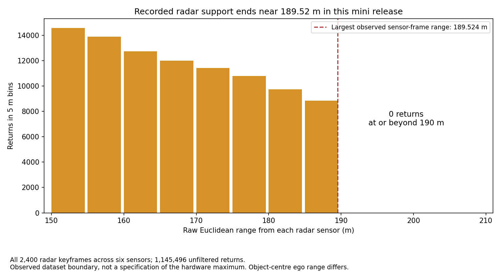
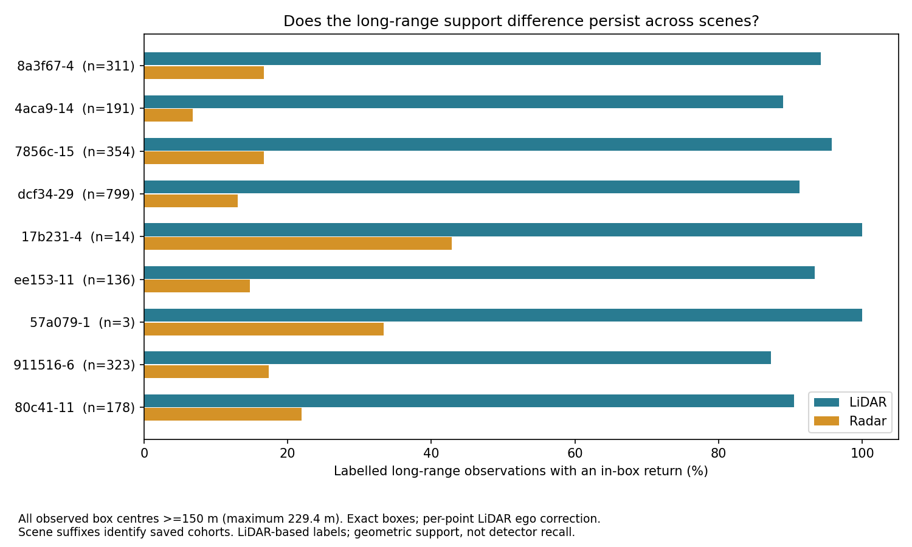

# Is LiDAR better at long range? Evidence audit

**New follow-up:** [TruckDrive paired results to 399 m and the cross-dataset review](long-range-cross-dataset-review.md) supersede the earlier TruckDrive download blocker. This document retains the TruckScenes-specific results.

22 September 2026 · Follow-up to [the paired client comparison](client-comparison-brief.md)

**The defensible finding is narrower: on these TruckScenes mini keyframes, LiDAR provides substantially more geometric support inside the released long-range object boxes. That finding survives our subgroup checks. We have not established that LiDAR generally detects distant objects better than radar.**

The deeper audit also found an important explanation for part of the difference: the recorded radar returns have an extremely consistent outer boundary near **189.52 m from each sensor**. The dataset therefore cannot fairly test radar detection at arbitrary longer distances. This materially qualifies the earlier 150–400 m summary.

## 1. Check the recorded range before comparing long-range performance

We independently reread **all 2,400 radar keyframe files**: six channels over the complete 400-sample mini release, including samples excluded from the paired timing analysis. Across **1,145,496 unfiltered returns**, there are **zero returns at or beyond 190 m in the original sensor frame**. All six channel maxima agree within 0.000003 m, at approximately 189.524145–189.524147 m.



This is a measured property of the downloaded point clouds, not an established sensor specification. It strongly suggests a shared acquisition or processing limit, but we have not identified its cause. It does not prove the physical radar cannot measure farther. Sensor-centred Euclidean range also differs from object-centred planar range measured from the truck's reference frame; large boxes and sensor offsets explain why an object centre slightly beyond 200 m can still contain a return.

The actual labelled long-range observations span **150.009–229.418 m**. There are only seven observations beyond 225 m and none at or beyond 250 m. **150–400 m was a storage bin; the earlier figure is not evidence of coverage to 400 m.**

Evidence: [channel maxima and counts](evidence/truckscenes/preprocessing-audit/radar_sensor_ranges.csv), [histogram](evidence/truckscenes/preprocessing-audit/radar_range_histogram.csv), [raw-file hashes](evidence/truckscenes/preprocessing-audit/manifest.json).

## 2. Does the difference remain before that boundary?

Yes, for geometric support in this annotation population. The primary definition remains at least one return inside the exact oriented 3D box. LiDAR uses per-point ego-motion correction; radar uses each acquisition pose. No detector runs or new labels are involved.

| Paired cohort | Observations | LiDAR support | Radar support |
|---|---:|---:|---:|
| 150–175 m | 1,091 | 93.40% | 22.00% |
| 175–200 m | 787 | 91.61% | 13.85% |
| 200–225 m | 424 | 87.74% | 0.24% |
| 225–229.42 m observed tail | 7 | 85.71% | 0.00% |
| Conservative 150–180 m subset | 1,258 | 93.16% | 22.10% |
| 150–180 m and forward ±30 degrees | 651 | 93.39% | 27.80% |

The 150–180 m restriction reduces the outer-range issue; it does not create a perfectly matched field of view or remove occlusion, annotation selection or sensor mounting differences. The seven-observation tail is too small to support a separate general claim.

## 3. Check classes, scenes and repeated observations

The pooled difference is not explained solely by signs or cones:

| Objects with centres at least 150 m away | Observations | LiDAR support | Radar support |
|---|---:|---:|---:|
| Vehicles, excluding ego trailer | 1,698 | 90.52% | 16.90% |
| Cars | 1,133 | 87.20% | 11.03% |
| Trucks | 347 | 97.69% | 28.24% |
| Trailers | 177 | 97.18% | 25.99% |

LiDAR has greater support in **all nine scenes containing long-range observations**. One of the ten mini scenes has no qualifying objects. Two qualifying scenes are particularly sparse: the snowy scene has three observations of one tracked object; the rainy terminal scene has fourteen observations of one object. These cannot establish weather-specific performance.



Removing any one qualifying scene leaves the pooled LiDAR-minus-radar gap between **75.70 and 77.64 percentage points**. To reduce repeated-observation bias, taking only the first qualifying observation of each of **436 tracked instances** yields **87.39% LiDAR versus 9.86% radar**. Weighting each track equally by its own support fraction gives **90.49% versus 12.33%**. These are robustness checks within the observed dataset, not population confidence intervals; objects in the same scene remain correlated.

The official mini validation split contributes 311 qualifying observations from just one of its two scenes: **94.21% versus 16.72%**. It is a narrow held-out-scene subset, not a model evaluation. Thresholds of one, three and five points, both exact boxes and 0.5 m expanded faces, and front/rear sectors are exported in the [complete sensitivity table](evidence/truckscenes/long-range-audit/sensitivity.csv). More points are not automatically better detections; expanded boxes may include background.

## 4. LiDAR count mismatch: investigated, not concealed

All 25,117 raw radar counts still agree exactly with publisher metadata. Our LiDAR recount differs for 20,953 observations, including 1,616 of the 2,309 long-range observations. There are 191 long-range boxes with positive published LiDAR counts but no points under our exact-box recount. We therefore do not use the publisher's 100% LiDAR-supported annotation population as a measured LiDAR recall score.

A dataset author confirms that annotation clouds used **one-degree sector-wise ego compensation**. Our per-point interpolation is not that exact procedure. [Author explanation, issue 18](https://github.com/TUMFTM/truckscenes-devkit/issues/18).

We tested four counting hypotheses on a fixed **30-frame subset**, three timestamp positions from each scene, covering **1,968 observations**:

| LiDAR processing hypothesis | Exact publisher-count matches | Long-range boxes with raw support / 176 |
|---|---:|---:|
| One pose per scan, all six channels | 165 / 1,968 | 123 / 176 |
| Per-point ego correction, all six | 327 / 1,968 | 170 / 176 |
| Per-point correction, two main side LiDARs only | 323 / 1,968 | 170 / 176 |
| One-degree sectors with mean point time, all six | 336 / 1,968 | 168 / 176 |

Neither using only the main LiDARs nor this sector approximation reproduces the published counts. The author's exact sector timestamp, odometry and counting implementation is not available in the material inspected. We keep the mismatch open; we have not adjusted transformations to manufacture agreement. [Counts and summary](evidence/truckscenes/preprocessing-audit/lidar_hypothesis_summary.csv).

The sector mean-time variant is explicitly our approximation. The authors also identify cabin movement and GNSS noise as sources of alignment error. [Author explanation, issue 27](https://github.com/TUMFTM/truckscenes-devkit/issues/27#issuecomment-3341741003). These explanations motivate further checks; they do not establish the cause of every mismatch.

## 5. What the published detector evidence actually supports

The original TruckScenes v1.0 test results report CenterPoint LiDAR mAP **0.27** versus RadarGNN radar **0.07** over the evaluated range. Table A4's 0–100 m and 0–150 m results are **cumulative**, not isolated far-range bins. They do not evaluate beyond 150 m. Architectures, training and temporal inputs differ, so this is a model-plus-modality comparison.

Counterexamples matter: overall car AP is **0.36 radar versus 0.33 LiDAR**; the fog subset ties at **0.15 mAP**. These prevent an unconditional "LiDAR wins" interpretation. We have not rerun these models. [Original paper, Tables 3 and A2–A5](https://arxiv.org/html/2407.07462v2).

HyperDet v4 evaluates radar preprocessing and learned foreground enhancement, with LiDAR used during training. It reinforces why a raw single-keyframe comparison does not settle what a radar detector can achieve with temporal and learned processing. It does not supply an independently reproduced >150 m result for this project. [HyperDet v4](https://arxiv.org/html/2602.11554v4).

## Claim to present and next experiment

> On the inspected TruckScenes mini keyframes, LiDAR provides more in-box geometric support for labelled objects at 150–180 m. This persists across vehicle classes, scenes and track weighting. Beyond roughly 190 m from each radar sensor, the recorded radar data itself has no returns. These findings support a dataset-specific coverage conclusion, not a universal long-range detection ranking.

Next, confirm the origin of the 189.52 m recorded boundary and the publisher's exact LiDAR counting procedure. Then compare compatible trained models within a verified common operating region, on the same held-out samples with matched temporal windows and explicit precision/recall evaluation. A six-sweep radar system should not be represented by our single-keyframe result. Testing beyond the recorded radar boundary needs another verified recording/configuration, not extra training on the same truncated observations.

Keep GOOSE's segmentation results separate. TruckDrive could provide an additional long-range setting once raw access, calibration, range limits and paired model availability are verified. Dataset pooling cannot resolve different sensor configurations or annotation policies.

## Reproduce

```powershell
python scripts/audit_long_range_support.py --data-root <TruckScenes-root>
python scripts/audit_truckscenes_preprocessing.py --data-root <TruckScenes-root>
```

Uses the existing TruckScenes CPU runtime. No new dependency, model inference, training, human acceptance signoff or timesheet entry is introduced. [Structured long-range summary](evidence/truckscenes/long-range-audit/summary.json) records inputs, cohort definitions and limitations; raw audit hashes and deterministic subset selection are in the preprocessing manifest. Result record 0017 and experiment log EXP-0014 record this follow-up.
