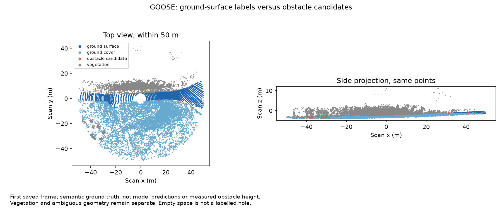

# Off-road: ground surface versus things above it

26 September 2026 · EXP-0022 · result 0027

## Question and scope

Can the system separate the supporting ground surface from objects protruding above it, and how does this change with distance? Keep holes, ditches and drop-offs as a separate negative-obstacle task. An empty patch in a scan is not a hole label: it can also be unobserved or occluded. Ground is not automatically safe to drive on; slope, roughness, water depth, softness and clearance are separate concerns.

Our radar/LiDAR object-box support results do not establish overall detection superiority: they count returns without a matched detector's predictions or false positives. Radar is not restricted to velocity measurement. Conventional LiDAR tracking can infer motion across scans; FMCW LiDAR directly measures per-return radial velocity. See [Aeva](https://www.aeva.com/aeries-ii/) and the [Doppler LiDAR odometry paper](https://arxiv.org/abs/2303.06511). These capabilities are not scores from our experiments.

## Completed LiDAR-only study

We regrouped the verified class counts for **961 GOOSE validation frames across eight scenarios**, and separately reanalysed **ten saved PTv3 prediction frames from one scenario**. No new inference was run. No paired radar terrain result is claimed.

The [explicit 64-label partition](evidence/offroad-ground/manifest.json) separates:

| Group | Examples | Interpretation |
|---|---|---|
| Ground surface | Asphalt, soil, gravel, cobble, sidewalk | Surface labels, not measured flatness or safe driveability |
| Ground cover | Low grass, moss, leaves, snow | May conceal the underlying surface |
| Obstacle candidate | Rock, tree trunk, fence, pole, vehicle, building | Height above local ground has not been measured |
| Vegetation | Bush, high grass, tree crown, hedge | Neither automatically floor nor a rigid blocking obstacle |
| Ambiguous geometry | Curb, root, debris, bridge, tunnel, rails | Requires geometry and context |
| Water | Water | No depth inference |
| Excluded | Sky, ego vehicle, undefined, outlier | Not evidence of floor, clear space or holes |



This deterministic first-frame illustration shows ground-truth labels, not predictions. Scan z is not height above a fitted ground surface. An obstacle candidate beside or above the route need not obstruct the vehicle's path.

## Distant off-road observations exist

**There are distant labelled LiDAR returns, but no verified long-range paired radar terrain benchmark in hand.** Full GOOSE validation contains:

| Planar range | Ground-surface points | Ground-cover points | Obstacle-candidate points |
|---|---:|---:|---:|
| 0–50 m | 11,175,321 | 30,843,549 | 25,790,372 |
| 50–100 m | 733,071 | 3,712,571 | 2,760,200 |
| 100–150 m | 129,285 | 812,943 | 511,258 |
| 150–400 m | 33,812 | 241,405 | 182,877 |

These are returned-point counts, not percentages of physical ground successfully observed. The last band pools returns within the interval, not continuous coverage to 400 m. Counts depend on scene content, visibility and sampling. The [inventory](evidence/offroad-ground/returned_point_inventory.csv) retains each scenario and all groups; this checked split has no points at or beyond 400 m.

## Saved model output: ground versus obstacle categories

We combine `artificial_ground` and `natural_ground` predictions into a ground category, and structure/obstacle/vehicle/human predictions into an obstacle category. Vegetation and other remain unresolved. This is a diagnostic of an eight-class model, not a newly trained binary ground detector.

| Range | True ground-surface points assigned a ground category | True obstacle-candidate points assigned a ground category |
|---|---:|---:|
| 0–25 m | 98.38% of 112,301 | 0.53% of 122,990 |
| 25–50 m | 98.32% of 48,786 | 0.84% of 150,332 |
| 50–75 m | 94.71% of 5,389 | 0.84% of 73,041 |
| 75–100 m | 90.36% of 1,359 | 1.59% of 26,459 |
| 100–150 m | 65.20% of 431 | 7.13% of 26,956 |
| 150+ m | No ground-surface points in these ten frames | 15.88% of 1,159 |

Asphalt predicted as natural ground is a material error but still lands on the ground side here. This explains why the first column is higher than the earlier asphalt-specific correctness. At 100–150 m, the remaining **34.80%** of ground-surface points are predicted as vegetation, not rigid obstacles.

Obstacle-labelled points assigned ground-like labels are a relevant confusion to investigate. At 100–150 m, **1,797 of those errors are building points** and 106 are fence points. Beyond 150 m, this obstacle subset contains only buildings and fences: it says nothing about distant rocks or roots. A ground-category prediction does not mean a vehicle would drive there; no planner was evaluated.

The ten consecutive frames all come from `2022-07-22_flight`. Points are correlated and class composition changes across bands. These are subset findings, not general performance estimates. [Fine-class confusion](evidence/offroad-ground/saved_fine_confusion.csv), [group confusion](evidence/offroad-ground/saved_group_confusion.csv) and [per-frame counts](evidence/offroad-ground/saved_frame_group_confusion.csv) preserve denominators and unresolved predictions.

## Paired radar/LiDAR feasibility: verified now

| Resource | Evidence | Remaining gap |
|---|---|---|
| Local GOOSE | Labelled LiDAR and saved predictions; no local radar bag | No radar terrain scores from this local split |
| STONE | Official bag metadata lists LiDAR and three radar PointCloud2 streams, 1,781 messages each | Raw points, transforms, label joins, visibility and grid version unverified |
| Great Outdoors | Official site lists LiDAR, 2D Navtech radar, raw topics and image/thermal segmentation packages | No verified ground-height benchmark in hand; 2D radar is less directly suited to vertical separation |

STONE's current [official README](https://github.com/konyul/STONE) describes 0.4 m voxels spanning x/y **−40 to +40 m**, with separate bag downloads. Its [paper](https://arxiv.org/html/2603.09175v1) evaluates 0.2 m voxels over **−25.6 to +25.6 m** using LiDAR-derived traversability labels. Inspect actual labels before selecting either documented configuration. Neither provides a 150–400 m annotated terrain test; traversability classes are also not direct floor/protrusion labels.

We downloaded and parsed the 4,607-byte metadata file for the first listed farmland sequence, `test0828_11_51_0_rosbag`. It reports sqlite3 storage, approximately 178 seconds, radar, LiDAR, odometry and transforms. The corresponding `.db3` is listed as **78.74 GB**. A bounded download probe returned HTML rather than SQLite bytes. We did not download the full bag or verify its points/transforms. Equal message counts do not prove synchronization. See [metadata audit](evidence/offroad-ground/stone_metadata_audit.json).

This corrects the older survey's assumption that all STONE access is one monolithic ZIP; it does not prove a ready-to-run mini benchmark. The [Great Outdoors download page](https://www.unmannedlab.org/the-great-outdoors-dataset/download/) is another source of bags, but its [platform](https://www.unmannedlab.org/the-great-outdoors-dataset/platform/) uses 2D radar, which must be acknowledged in a height-based task.

## Next paired experiment

Use a synchronized STONE sample and **0–10, 10–20, 20–40 m** bands if its actual label grid supports them; otherwise shorten the last band. Restrict comparison to shared field of view and retain occluded/unknown regions.

1. Verify a local reference ground surface that follows slopes. Measure object height relative to it, not against a global z cutoff. Keep vegetation and rock/root/curb height separate from semantic names.
2. Measure support of labelled ground patches and obstacle regions at several spatial tolerances. Disclose that a LiDAR-derived reference favours LiDAR-visible surfaces; same-frame LiDAR hits are not an unbiased denominator for LiDAR misses.
3. Report missed obstacle regions, obstacles called ground, ground called obstacles and unresolved regions. Keep return counts, occupied cells and model errors distinct.
4. Test holes/drop-offs only with explicit depth/edge reference labels or multi-view ground geometry. Neither absent points nor STONE's free-space class directly labels a hole.

The immediate dependency is a manageable verified radar/LiDAR/label sample. The LiDAR diagnostic above is complete; paired-sensor and negative-obstacle evaluation remain open.

## Reproduction

```powershell
python scripts/analyse_offroad_ground.py --root <GOOSE-validation-root> --predictions <saved-run>/result --mapping <GOOSE-archives>/challenge_label_mapping.csv
python -m unittest discover -s tests -v
python scripts/validate_result.py
python scripts/validate_experiment_logs.py
```

The script reuses committed full-validation counts and checks raw scan/label/prediction hashes against the preceding study. The [manifest](evidence/offroad-ground/manifest.json) records the mapping and limits. No new packages or inference were needed. Figure derived from GOOSE ground truth, credited to the GOOSE dataset authors under CC BY-SA 4.0; see the [official dataset](https://goose-dataset.de/).
