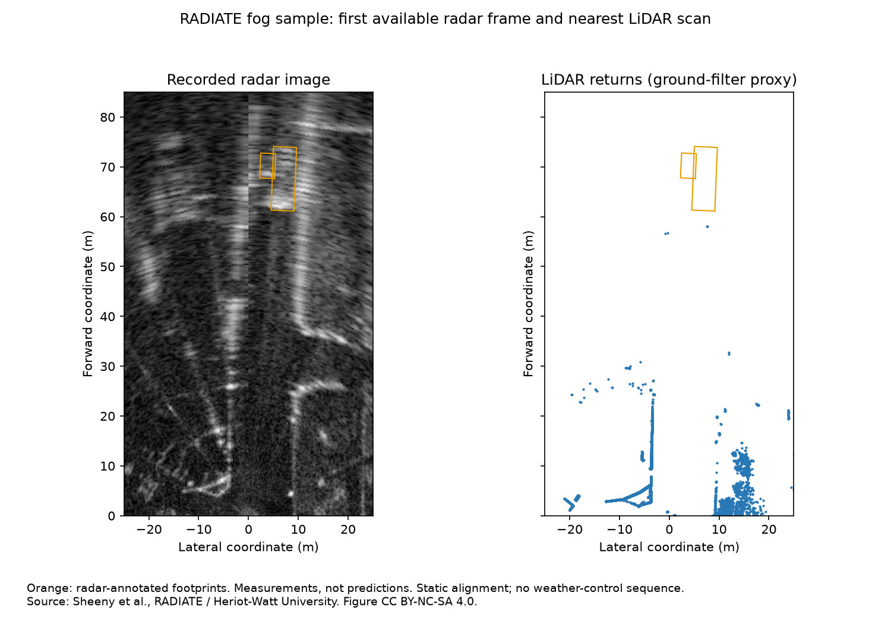

# RADIATE fog: useful radar evidence where LiDAR is sparse

28 September 2026 · EXP-0026 · result 0031 · descriptive pilot, not detector accuracy

**In this short fog sample, several radar-annotated vehicle regions have visible
radar contrast while the paired LiDAR scan has no above-ground returns in their
footprints.** This gives the client a concrete complement to the LiDAR-dense
terrain cases, without declaring either sensor universally better.



## What was run

Downloaded the official public `tiny_foggy.zip` (34,550,966 bytes), verified its
SHA-256 and all extracted ZIP member CRCs, and processed its `fog_6_0` sequence.
The archive has 18 radar frames. **17 pass the <=50 ms nearest-LiDAR timing gate**;
the final radar frame is excluded because the nearest available LiDAR is 128.87 ms
earlier. Eligible radar/LiDAR offsets range from −43.69 to +49.15 ms.

There are **39 eligible vehicle-box observations from four tracks** (one bus and
three cars) across roughly four seconds. Repeated views of one vehicle are not
independent detections. This public sample contains radar, LiDAR, camera, timestamps
and radar-derived annotations; the full dataset requires registration.

Sources: [official download](https://pro.hw.ac.uk/radiate/downloads/),
[dataset and calibration documentation](https://pro.hw.ac.uk/radiate/doc/dataset/),
[SDK](https://github.com/marcelsheeny/radiate_sdk).

## Two deliberately different measurements

1. **LiDAR footprint support:** count returns in the rotated annotated BEV box,
   after published static calibration, with native LiDAR z > −1.5 m as the SDK's
   simple ground-removal proxy. A 2D footprint can also contain unrelated points
   at different heights; this is not a 3D object detection.
2. **Radar image contrast:** compare the box's 99th-percentile image intensity
   with that of a surrounding 3 m ring, excluding annotated boxes from the ring.
   Require at least five box pixels above the ring's 99th percentile. Also report
   stricter intensity gaps of 10 and 20 grayscale levels. These are explicit
   diagnostic thresholds, not a trained detector or validated false-alarm rate.

| Distance | Box observations (tracks) | Any LiDAR return above ground proxy | Radar local contrast | Radar contrast with >20-level gap |
|---|---:|---:|---:|---:|
| 0–25 m | 6 (2) | 0/6 | 5/6 | 5/6 |
| 25–50 m | 14 (2) | 3/14 | 10/14 | 3/14 |
| 50–75 m | 19 (3) | 0/19 | 16/19 | 9/19 |

**Do not subtract these columns and call the difference detection accuracy.**
The radar image and LiDAR points have different sampling/processing, and the
annotations were made on radar. A radar-bright region can include clutter or
multipath; a LiDAR-empty footprint can reflect timing, occlusion, surface response,
fog, or limited scan geometry. This study cannot assign a unique cause.

## Sensitivities and useful limits

- Expanding every footprint by 1 m gives LiDAR support in 1/6, 6/14 and 1/19
  observations respectively. Allowing either adjacent LiDAR scan as well gives
  2/6, 9/14 and 2/19 with the expanded footprint. This is an optimistic temporal
  sensitivity, not a real-time detector score or target-motion compensation.
- At 50–75 m, the strict >20-level radar contrast test passes **9/19** annotated
  observations. It passes **1/57** equal-range control regions obtained by
  rotating those footprints by 90°, 180° and 270° around the sensor. Controls
  overlapping annotations are excluded. They are **unlabelled regions**, not
  verified empty negatives, so 1/57 is not detector false-positive rate.
- Across all distances, the unlabelled controls pass the basic contrast check
  in 32/117 cases and the >20-level check in 8/117. Basic brightness alone is
  therefore weak evidence; the stricter test and spatial illustration matter.
- The median across paired scans of the 90th-percentile LiDAR return distance is
  **15.42 m**. This describes recorded point concentration, not maximum sensor
  range; a few returns extend substantially farther.
- There is no clear-weather control, no radar/LiDAR learned model, no AP score,
  no >75 m eligible vehicle observation and no off-road ground-truth label here.
  It does not establish how much of the difference was caused by fog, nor a
  general sensor ranking. Radar annotation selection also favours radar-visible
  targets, unlike STONE's LiDAR-derived reference.

## Method details and next step

The pixel scale is 100/576 m, matching the SDK's 1152-pixel BEV extent. Rotated
boxes use the SDK's image rotation convention. The published LiDAR translation
is `[0.6003,-0.120102,0.250012]` m; tiny rotations follow the SDK's degree convention.
The code applies the metric transform explicitly: the inspected SDK helper
computes `new_pos` but returns the original `pos` in its annotation/point-cloud
transform methods, so those helpers are not copied as functioning calibration.
Static calibration, residual timing, rolling radar scans and moving targets remain
limitations; no ego/object-motion correction is claimed.

The next independent test should use several full RADIATE fog/rain/snow and
clear-weather sequences with matched classes/ranges and an agreed detector or
signal-level protocol. Full access requires registration; the public pilot is
complete without it. Continue STONE only when the physical radar calibration can
be independently validated.

```powershell
python -m pip install -r requirements-stone.txt
python scripts/analyse_radiate_fog.py --root F:\RADAR\datasets\RADIATE
python -m unittest discover -s tests -p test_radiate_fog.py -v
```

Evidence: [manifest and hashes](evidence/radiate-fog/manifest.json),
[observations](evidence/radiate-fog/observations.csv),
[summary](evidence/radiate-fog/summary.csv),
[unlabelled controls](evidence/radiate-fog/unlabelled_controls.csv),
[paired frame inventory](evidence/radiate-fog/frames.csv),
[SDK source revision](evidence/radiate-fog/sdk_source.json).

Credit: Sheeny et al., RADIATE / Heriot-Watt University. Figure derived from the
dataset under CC BY-NC-SA 4.0, with our footprint overlay and LiDAR projection;
the derived figure is shared under the same licence. No raw archive is committed.
