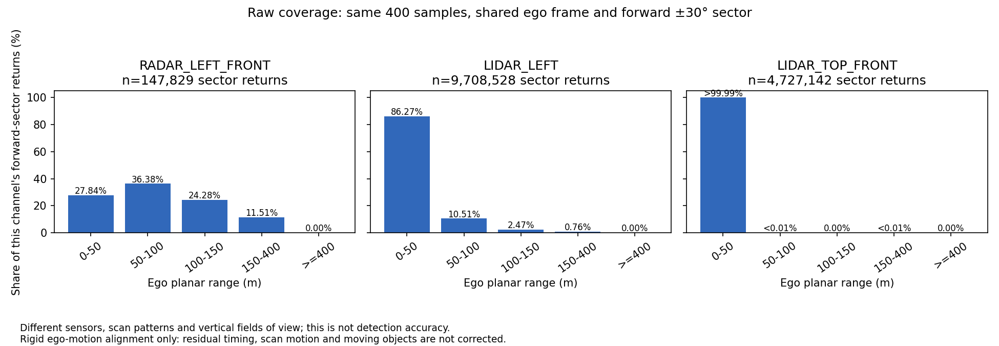
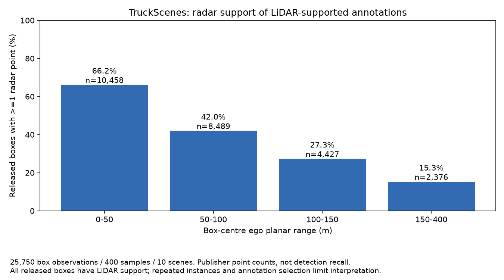
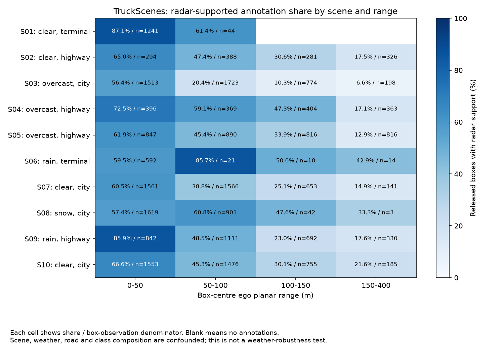
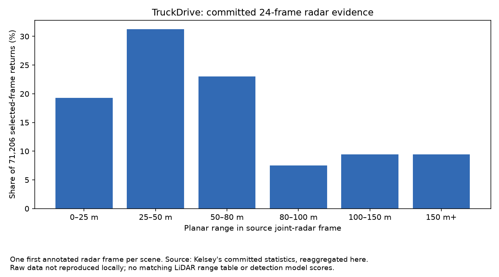
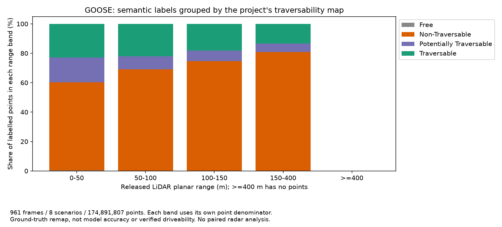

# Sprint 3 findings: TruckScenes, TruckDrive and GOOSE

**TruckDrive status update, 22 September:** the [new paired long-range experiment](long-range-cross-dataset-review.md) has verified scene_28_1 downloads and completed static/acquisition-aligned recounts. TruckDrive saved-table and download-blocker statements below describe the earlier stage.

Updated 22 September 2026. Analysis executed through Codex on the local CPU.

**Follow-up:** the [client comparison briefing](client-comparison-brief.md) adds
all 12 TruckScenes sensor channels, paired raw object counts and per-point LiDAR
ego-motion correction. Use that briefing for the latest paired support results;
the three-channel and publisher-count summaries below retain their original scope.

We now have a larger, reproducible **sensor-coverage comparison within TruckScenes**,
an object-level breakdown of its annotation point support, and a complete GOOSE
range/semantic breakdown. TruckDrive's committed evidence has been reanalysed, but
its raw files could not be downloaded on this machine. **A matched radar-only versus
LiDAR-only detector accuracy benchmark is still outstanding.**

## What was run

| Dataset | Evidence used in this update | What it answers |
|---|---|---|
| TruckScenes v1.2-mini | All 400 samples in 10 scenes; three raw channels independently aligned to the same sample-time ego frame; all 25,750 released annotation records | Where returns occur, and how publisher-provided object support varies by range, class and scene |
| TruckDrive | Kelsey's committed tables: one annotated radar frame in each of 24 scenes; separate class totals over 4,800 annotation frames | What the saved survey supports; sampling, class imbalance and remaining calibration requirements |
| GOOSE labelled 3D validation download | All 961 paired frames, eight scenarios, 174,891,807 points; SHA-256 for every input scan and label | How semantic/traversability label composition changes with range and scenario |

These are different populations and tasks. The figures use separate dataset panels;
their counts and percentages are not a cross-dataset performance leaderboard.

## TruckScenes: expanded raw sensor comparison

The previous run covered 80 official `mini_val` samples. This run covers all 400 mini
samples, including training scenes **for characterisation only**. It does not expand
the detector evaluation split. The saved camera predictions still apply only to
the original 80 samples.

Every channel uses its released calibration, acquisition ego pose and the nearest
sample-time ego pose. Range is planar ego x-y distance. The common forward sector is
x > 0 and azimuth within +/-30 degrees, with no elevation mask. Sensor/sample offsets
must be <=50 ms and pose/reference offsets <=10 ms. This is rigid ego-motion alignment;
per-point scan motion, moving objects and additional cabin motion are not compensated.
The channels have different scan patterns, vertical fields of view and occlusion.
These are three selected channels, not both complete sensor suites.

| Channel | Forward-sector returns, all 400 samples | Returns at 150–400 m | Share of that channel's sector returns |
|---|---:|---:|---:|
| RADAR_LEFT_FRONT | 147,829 | 17,014 | 11.5092% |
| LIDAR_LEFT, corner LiDAR | 9,708,528 | 73,413 | 0.7562% |
| LIDAR_TOP_FRONT, roof LiDAR | 4,727,142 | 1 | 0.000021% |

No selected-channel returns fell at >=400 m. The 150–400 m label defines a bin;
it does not imply continuous coverage throughout that interval.

The radar distribution has a larger distant-return share, while the corner LiDAR
provides more distant points in absolute count. Both statements are true because
the denominators differ. The roof channel behaves very differently from the corner
channel, so it cannot stand for all LiDAR. These measurements do **not** establish
which sensor detects objects more accurately, or which degrades less with distance.



Evidence: [aggregates](evidence/truckscenes/full-mini-coverage/aggregate_ranges.csv),
[per-sample counts](evidence/truckscenes/full-mini-coverage/sample_ranges.csv),
[calibration/timestamp manifest](evidence/truckscenes/full-mini-coverage/manifest.json).
All-azimuth counts are also included in the CSVs.

## TruckScenes: support of the same annotated objects

This second analysis uses the **same released box observations** for both modalities.
The publisher defines `num_radar_pts` as the count inside a box, summed over all radar
sensors without invalid-point filtering. `num_lidar_pts` counts points in the box
during the associated LiDAR sweep. We read these fields; we have not independently
recounted them. They are separate from the three-channel raw comparison above.
[Official schema](https://github.com/TUMFTM/truckscenes-devkit/blob/main/docs/schema_truckscenes.md).

The 25,750 observations contain 1,094 instance tokens. Instances repeat over frames
and are not tracked across scenes, so these are not 25,750 independent objects.
**All 25,750 released observations have at least one LiDAR point.** Only 12,060
(46.8350%) have radar points. The annotation population therefore cannot measure
performance on objects without LiDAR support; a claimed "100% LiDAR recall" would
be unjustified. Radar returns inside a box are not a model detection either.

| Box-centre range | Box observations | With radar points | Radar-supported share | Median LiDAR points / radar points |
|---|---:|---:|---:|---:|
| 0–50 m | 10,458 | 6,922 | 66.19% | 203 / 1 |
| 50–100 m | 8,489 | 3,566 | 42.01% | 25 / 0 |
| 100–150 m | 4,427 | 1,209 | 27.31% | 9 / 0 |
| 150–400 m | 2,376 | 363 | 15.28% | 6 / 0 |

Ranges include their lower edge and exclude their upper edge. All classes are kept
here; the separate raw box plot uses the stock detection taxonomy, which excludes
239 unmapped annotation observations. No released box centres fall at >=400 m.

Class composition matters. For cars at 150–400 m, 11.12% of 1,169 observations have
radar support; for trucks it is 28.29% of 357. Among adult pedestrian observations
at 100–150 m, none of 110 has radar support; the 150–400 m pedestrian bin contains
only seven observations. These counts support follow-up inspection, not a general
claim about pedestrian detection or radar safety.




Scene rows expose variation and their denominators. There is one snow scene and two
rain scenes, with different roads, lighting and class mixes. This cannot isolate a
weather effect. [Full scene IDs and descriptions](evidence/truckscenes/object-support/scene_legend.csv),
[class/range counts](evidence/truckscenes/object-support/class_range_support.csv),
[per-object records](evidence/truckscenes/object-support/objects.csv) and
[source hashes](evidence/truckscenes/object-support/manifest.json) make the analysis traceable.

## TruckDrive: what can currently be compared

Reaggregating the committed source reproduces 71,206 radar returns, including 6,746
at >=150 m (9.4739%), from **24 selected frames**, not all 12,502 radar frames.
The separate 27-class table sums to 526,148 box observations over 4,800 annotated
frames. The generic `Vehicle` class alone accounts for 313,408 observations;
class definitions must be reconciled before comparing class-specific results with
TruckScenes. These are teammate measurements, not a fresh raw-data reproduction.



The two saved multimodal checks report 217,519 LiDAR points / 2,672 radar returns
for one selected scene_28_1 frame and 451,201 / 3,038 for one scene_28_22 frame.
They contain no matched LiDAR range distribution. The 4,377 radar returns quoted
elsewhere for scene_28_22 come from a different selection rule: its first annotated
radar frame. Those counts must not be paired with the 451,201-point LiDAR frame.
Furthermore, scene_28_22 was selected after finding the largest distant radar count
among the 24 sampled frames, so it is a deliberate long-range example, not a random
representative scene. [Source and selection details](../TruckDrive%20-%20Kelsey/dataset-statistics.md).

Hugging Face access was visibly granted on 22 September. The authenticated file
download reached `us.aws.cdn.hf.co`, where Chrome reported `ERR_BLOCKED_BY_CLIENT`.
No ZIP was verified locally and no CLI login was available. The network cause is
unconfirmed. No browser security setting was changed. The blocker is file delivery,
not dataset-access approval.

The next raw run should use scene_28_1 as the predeclared primary feasibility scene,
and scene_28_22 separately as the selected stress case. Match annotations, Aeva joint
LiDAR and joint radar by sync ID, preserve timestamp offsets, and transform both
clouds through calibration to the annotation `velodyne` frame. The official viewer
maps their original frames differently; comparing raw x/y values directly would
compare different origins. Use the same region/range definitions and account for
residual timing before any object-support recount. The released formats are Aeva
float64 x11 and radar float64 x33.
[Official layout, frames and formats](https://github.com/torc-ai/TruckDrive/blob/main/dataset_viewer/README.md).

Downloads needed first: annotations, calibration, poses, radar and LiDAR for that
primary scene; camera and accumulated-depth archives are unnecessary for this
sensor comparison. Keep the original archives and verify integrity before extraction.
This raw run remains open until the files can be delivered.

## GOOSE: terrain and range composition

All 961 paired scans were read and hashed. They contain the same 174,891,807 points
as the earlier full-split characterisation. No identical scan-and-label content
pairs were found. This confirms the local inventory; it does not resolve any
difference between published rounded split sizes and archive contents.

85.91% of points are within 50 m; 1,928,423 points (1.1026%) are at >=150 m.
The project's "Traversable" group accounts for 22.92% of points within 50 m,
versus 13.33% of the points at 150–400 m. This reflects labelled scene composition,
range and occlusion, not a model becoming less accurate. "Free" is the mapping's
existing semantic group, not a measured guarantee of obstacle-free space.



The [class table](evidence/goose/range-support/class_ranges.csv) and
[traversability table](evidence/goose/range-support/traversability_ranges.csv)
include each of eight scenarios and a pooled `ALL` row. Do not sum `ALL` and the
scenario rows together. The [frame table](evidence/goose/range-support/frame_ranges.csv)
and [hash manifest](evidence/goose/range-support/manifest.json) support reproduction.
No local raw radar bag was present. There is no new GOOSE radar comparison,
segmentation inference or mIoU score in this update.

## What the project should do next

1. **Review these evidence tables and merge the PR stack through the normal gate.**
   A person should check the limits and confirm the interpretation before using
   the figures in a presentation. Automated checks do not supply that signoff.
2. **Finish the calibrated TruckDrive raw pair once downloads work.** Preserve
   the declared primary/stress-scene distinction and exact sync IDs. Do not choose
   additional scenes based on whichever sensor looks strongest.
3. **Resolve the detector/checkpoint gate for TruckScenes.** The current saved
   FCOS3D results are camera-only. Their reproduced mAP values are 0 and
   0.004648 (one/four cameras), and cannot fill the radar/LiDAR comparison.
   Obtain compatible radar-only and LiDAR-only checkpoints with documented training
   data, classes, preprocessing, temporal inputs and code versions. No compatible
   paired checkpoint set was verified in this update.
4. **Use a fixed evaluation protocol before spending GPU time.** Start with one
   frame for loading/geometry, then both methods on all 80 official mini_val tokens,
   the same annotation taxonomy, evaluator/config and temporal horizon. Disable
   camera/map/other-sensor inputs explicitly. Different model families or training
   budgets produce a model-plus-modality comparison, not an isolated sensor effect.
   The stock TruckScenes class ranges stop at 75 or 150 m; a >150 m detector score
   needs a separately agreed protocol, not a renamed stock mAP.
5. **Keep GOOSE as the off-road semantic strand and assemble the synthesis.**
   Explain what each dataset contributes, what was measured and what remains open.
   More CPU statistics are feasible locally; training cost cannot be estimated
   responsibly until the models and protocol are selected. The official TruckDrive
   model README provides a LiDAR training command using eight processes, but does
   not by itself provide the missing paired ready-to-run checkpoints.
   [Official model instructions](https://github.com/torc-ai/TruckDrive/blob/main/mmdet_project/README.md).

## Reproduction

From this repository, with raw datasets outside Git:

```powershell
python scripts/compare_truckscenes_raw.py --data-root <TruckScenes-root> --split mini
python scripts/truckscenes_object_support.py --data-root <TruckScenes-root> --output-dir docs/evidence/truckscenes/object-support
python scripts/goose_range_support.py --root <goose_3d_val-root> --output-dir docs/evidence/goose/range-support
python scripts/plot_dataset_support.py
```

TruckScenes: Python 3.11.9, devkit 1.2.0, NumPy 1.26.4, matplotlib 3.8.4,
pypcd4 1.4.3, pyquaternion 0.9.9. GOOSE and the report plots use the existing
CI environment (Python 3.11, NumPy 2.4.6, matplotlib 3.11.2, PyYAML 6.0.3).
No new dependencies or GPU inference were introduced. Results 0013–0015 and
[EXP-0012](../experiment-log/0012-dataset-range-and-support-comparison.md) record
the scope and limitations. This work does not add personal timesheet hours or
human acceptance signoffs.

Validation: 160 unit tests passed; all 15 result records and experiment-log IDs
passed their validators. Exported per-sample/per-object counts were reconciled
against the aggregates, and GOOSE frame/scenario/pooled totals agree.
[Verification summary](evidence/dataset-comparison-verification.json).
