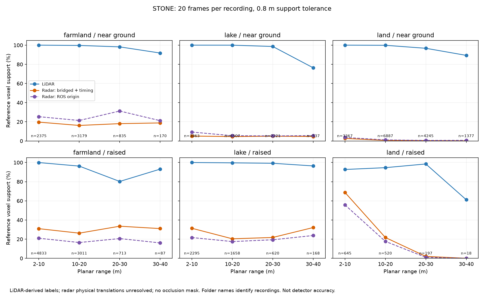

# STONE follow-up: lake and land recordings

28 September 2026 · EXP-0025 · result 0030 · conditional geometric-support study

**We extended the original 20-frame farmland pilot to 60 frames across three
recordings.** Each added recording has 20 uniformly spaced interior frames,
selected before scoring. All three radar streams, LiDAR, labels, odometry and
released static transforms were decoded. The work ran on CPU.

The important new observation is that **radar ground support is especially sparse
in the added lake and land recordings**, under both tested origin conventions.
Radar supports more raised geometry than ground there. That distinction was
ambiguous in farmland, where the ordering reverses when the coordinate origin
changes. Environment and scene content matter; a single pooled ranking hides this.



## Measurements

Same method as [the original pilot](stone-paired-terrain-pilot.md): occupied
LiDAR-derived reference voxels, local traversable-plane heights, 0.8 m nearest
return tolerance, 2–40 m planar distance, ±60° horizontal/±10° vertical declared
radar ROI. Neither a voxel nor a return is an independently detected object.

| Recording | Geometry | Reference voxel observations | LiDAR support | Radar: bridged + timing | Radar: ROS origin |
|---|---|---:|---:|---:|---:|
| Farmland | Near ground | 6,559 | 99.41% | 17.76% | 24.07% |
| Farmland | Raised | 8,644 | 96.96% | 29.53% | 19.33% |
| Lake | Near ground | 13,128 | 98.78% | 4.82% | 6.59% |
| Lake | Raised | 4,741 | 99.64% | 26.30% | 20.00% |
| Land | Near ground | 15,876 | 98.13% | 0.94% | 1.47% |
| Land | Raised | 1,380 | 93.84% | 40.65% | 32.90% |

“Lake” and “land” are the official bag-folder names, not our verified labels for
every surface or weather condition in those runs. The recordings are
`test0828_11_51_0`, `test0827_14_42_0`, and `test0826_18_06_0` respectively.
They span roughly 178, 260 and 60 seconds. Different crops of one recording
are not treated as independent routes.

The added 40 frames contain **8,754,816 valid LiDAR returns and 17,866 radar
returns**, before ROI filtering. Combined with farmland: 12,257,897 LiDAR and
21,095 radar returns. Counts depend on sensor processing and scene content.

The complete local STONE workspace, including cached archive blocks and the
earlier metadata audit, occupies about 1.31 GiB after this extension. The
separate RADIATE sample and extracted files use about 0.09 GiB. Storage and CPU
capacity were sufficient; no GPU stack or existing project environment was changed.

In the lake recording, radar near-ground support stays around 4.6–5.2% across
the four bands. In land it falls from 2.64% at 2–10 m to 0.07% at 30–40 m.
Raised geometry in land has 68.84% radar support at 2–10 m but only 18 reference
voxel observations in the 30–40 m band; that last band's 0% radar support cannot
support a general distant-obstacle conclusion. See per-band denominators in the
[comparison CSV](evidence/stone-environments/comparison.csv).

## Calibration investigation: completed checks, unresolved input

Both additional bags contain the **same zero-translation radar transforms** as
farmland, with the same nominal rotations. The exported LiDAR calibration still
uses a different origin. Neither recording supplied an independently validated
physical radar mounting translation. The official repository was refreshed on
28 September; it still contains the README and presentation assets rather than
a calibration/devkit release. The earlier archive/info-file search remains in
[the pilot report](stone-paired-terrain-pilot.md#calibration-and-timing-sensitivity).

We did not fit radar onto LiDAR and call that ground truth: optimizing alignment
against the same surfaces used for scoring would make the result circular without
independent validation. The two origin conventions are sensitivity experiments,
not uncertainty bounds that contain every possible mounting error.

All joined exported poses pass the strict absolute 1e-7 matrix check. Added radar
header offsets range from −25.46 to +26.74 ms; no pose extrapolation was used.
The reference remains LiDAR-derived, visibility/occlusion is unresolved, and local
height is available only where traversable anchor columns support a plane.
There is no learned terrain classifier, instance recall, hole label, or driving
safety evaluation here.

**STONE handover:** downloading, decoding, cross-recording joins, support metrics
and sensitivity checks work. A validated radar calibration and independent
visibility/obstacle reference remain prerequisites for a stronger claim. We have
moved to a complementary weather dataset rather than treating this as solved.

## Reproduce

Install `requirements-stone.txt` in the existing isolated Python 3.11 environment.
The adapter supports the three explicitly named releases and rejects a changed
topic-row layout. Camera payloads and whole bags are not downloaded.

```powershell
python scripts/prepare_stone_pilot.py --root F:\RADAR\datasets\STONE --recording lake
python scripts/acquire_stone_pilot.py --root F:\RADAR\datasets\STONE --recording lake
python scripts/compare_stone_terrain.py --root F:\RADAR\datasets\STONE --recording lake
# Repeat those three commands with --recording land.
python scripts/summarise_stone_environments.py
```

The existing farmland evidence is preserved. New outputs have separate
[lake](evidence/stone-environments/lake/manifest.json) and
[land](evidence/stone-environments/land/manifest.json) manifests, input hashes,
frame counts, timing offsets, reference counts and all sensitivity tables.
Original data remains on F:. Credit: [Park et al., STONE](https://github.com/konyul/STONE).
