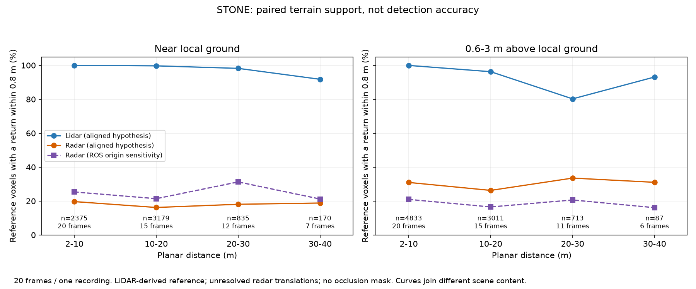

# STONE: ground and raised-obstacle support

26 September 2026 · EXP-0023 · result 0028 · **conditional pilot, not a detector benchmark**

## What we can tell the client

We now have a working CPU pipeline for paired off-road radar and LiDAR, with
actual terrain labels. In 20 sampled farmland frames, LiDAR supplies much denser
geometric evidence than the three recorded radar point clouds. Radar's sparse
returns leave many labelled surface patches without a nearby measurement.
However, **the released radar translations are unresolved and the reference
comes from LiDAR**. These figures cannot establish unbiased detection accuracy,
safe traversability, or a universal sensor ranking.

The most important sensitivity result is that the radar ground-versus-raised
ranking reverses under the alternative coordinate-origin assumption. We should
resolve calibration before claiming that radar particularly misses the floor or
particularly favours protruding obstacles. More downloaded frames alone will
not resolve this issue.



## Data actually processed

- Official first listed farmland recording, `test0828_11_51_0_rosbag_0.db3`.
- Twenty uniformly spaced interior frame indices, selected before scoring,
  spanning approximately 178 seconds of **one physical recording**. Exported
  nuScenes scene chunks are not independent drives.
- Three Continental ARS548 PointCloud2 streams, one Hesai LiDAR scan and matching
  traversability labels per frame; all 60 radar messages joined by bag timestamps.
- **3,503,081 valid LiDAR returns and 3,229 valid radar returns** before ROI
  filtering. Per frame: 101,407–206,072 LiDAR and 36–374 combined radar returns.
  These are the exported radar detection points, not all radar energy or objects.
- Verified label arrays are `200 × 200 × 16`, with 0.4 m voxels over
  `[-40,-40,-1]` to `[40,40,5.4]` m. This matches the
  [pinned official README](https://github.com/konyul/STONE/blob/4ba5f700ddeb709a0e645bdd5fda082b0561d282/README.md).
  The older paper configuration is not silently substituted.

Raw data and cache are at `F:\RADAR\datasets\STONE`; local footprint at completion
was about **0.86 GiB**, including metadata and exploratory files. The paired sample
itself is about 89 MiB. Byte-range reads obtained necessary parts of the 346 GB ZIP
and 84.5 GB bag; neither whole archive was downloaded. Raw scans are not committed.

## What the percentages mean

Each reference is the **centre of an occupied labelled voxel**, not a car, rock,
independent object or detector prediction. A supported voxel has at least one
sensor return within 0.8 m in 3D. One return can support several neighbouring
voxels, so this is not exact surface reconstruction. The CSVs also report 0.4 m
and 1.2 m tolerances. Unknown (255) and free (0) labels are excluded.

Thus “radar supports 20%” means roughly 20 of 100 eligible reference voxel
observations have a sufficiently close recorded radar point under the stated
alignment. It does **not** mean radar detected 20 of 100 obstacles. An unsupported
voxel could reflect sparse sampling, visibility, filtering, timing or calibration;
this study does not distinguish all those causes.

We retain native traversability classes separately. For the floor/protrusion
question, local planes are fitted to nearby traversable-reference columns:

- **Near ground:** within 0.3 m of that local plane.
- **Raised:** 0.6–3 m above it. This can include vegetation and is not necessarily
  an obstacle in the vehicle's route.
- **Unresolved:** no sufficiently supported local plane, intermediate heights,
  or outside the stated intervals. No fabricated ground height or hole label.

Only 27,736 of 116,932 occupied reference voxel observations have a resolved local
height before ROI filtering. The geometric groups are therefore a selective
subset; the native-class CSVs retain the rest. Plane fits require at least six
nearby columns, spatial spread, bounded slope and <=0.2 m residual RMS.

## Primary conditional results

Nearest-return tolerance 0.8 m; header-time ego-motion correction; declared
radar angular ROI of ±60° horizontal and ±10° vertical, union across three sensors.
Distances below are planar distance from exported ego origin, lower inclusive.
The ROI is an analysis restriction, **not a verified occlusion or common-visibility
mask**. Ground truth was produced using LiDAR, favouring LiDAR-visible surfaces.

| Distance | Near-ground reference voxels (frames) | LiDAR support | Radar support | Raised reference voxels (frames) | LiDAR support | Radar support |
|---|---:|---:|---:|---:|---:|---:|
| 2–10 m | 2,375 (20) | 100.0% | 19.7% | 4,833 (20) | 99.9% | 31.0% |
| 10–20 m | 3,179 (15) | 99.7% | 16.2% | 3,011 (15) | 96.2% | 26.3% |
| 20–30 m | 835 (12) | 98.2% | 18.1% | 713 (11) | 80.2% | 33.5% |
| 30–40 m | 170 (7) | 91.8% | 18.8% | 87 (6) | 93.1% | 31.0% |

The last band has very little height-resolved evidence. Its rebound for raised
LiDAR support is **not** evidence that LiDAR improves at longer range: scene
content changes between bands and the same physical obstacles were not tracked.
Neither sensor exhibits a clean monotonic decay curve here. Do not extrapolate
this 2–40 m analysis to 150–400 m.

## Calibration and timing sensitivity

The exported LiDAR calibration has translation `[0.16,0.12,0.54]` m and a −90°
yaw. ROS TF uses almost the same LiDAR yaw but zero translation. All three radar
TF translations are also zero. We cannot verify these as measured physical
mounting offsets. The primary hypothesis bridges ROS base to exported ego using
the two LiDAR transforms, then applies the released radar rotations. The
alternative keeps radar at the ROS origin while holding the same reference cohort
fixed. Neither constitutes recovered physical radar calibration.

The [paper's calibration section](https://konyul.github.io/STONE-dataset/assets/paper/final_paper_compressed.pdf)
states that radar–LiDAR calibration was performed. In the inspected archive,
the only calibration-named member is `calibrated_sensor.json`, containing the
camera/LiDAR export. We also inspected both validation info pickles as inert
opcodes, without executing pickle contents: no explicit radar-channel calibration
entry was identified. [Audit hashes and relevant field names](evidence/stone-pilot/calibration_metadata_audit.json)
record that search. This does not prove a calibration file is unavailable elsewhere.

| Coordinate/timing hypothesis | Radar near-ground support, pooled 2–40 m | Radar raised support, pooled 2–40 m |
|---|---:|---:|
| Bridged origin, no time correction | 17.79% | 29.59% |
| Bridged origin, header-time correction | 17.76% | 29.53% |
| Released ROS origin, no time correction | 24.07% | 19.33% |

Ground and raised denominators are 6,559 and 8,644 voxel observations respectively.
**The ground/raised ordering reverses.** Timing has little pooled effect in this
recording; origin choice has a large effect. This is the evidence for treating
calibration as the immediate blocker to a stronger terrain conclusion.

Radar header offsets range from −27.66 to +22.58 ms relative to the joined bag
timestamp. All 1,781 odometry poses were decoded; linear position interpolation
and quaternion Slerp correct ego motion, with no extrapolation. Exported ego
poses match corresponding bag poses within an absolute 1e-7 matrix tolerance.
This does not independently verify sensor clock synchronization or per-point
LiDAR deskew; no moving-object correction was performed.

Widening the vertical ROI to ±20° gives pooled radar support of 17.39% near ground
and 29.09% raised under the primary alignment, versus 17.76%/29.53% at ±10°.
The outputs retain native classes, both angular choices, three spatial tolerances,
all three alignment variants, pooled counts and equal-frame averages. They are
descriptive sensitivities, not statistical confidence bounds.

## Reproduction and provenance

Use an isolated Python 3.11 environment; no GPU training, ROS installation or
changes to existing project environments are needed:

```powershell
python -m venv F:\RADAR\envs\stone
F:\RADAR\envs\stone\Scripts\python -m pip install -r requirements-stone.txt
F:\RADAR\envs\stone\Scripts\python scripts/prepare_stone_pilot.py --root F:\RADAR\datasets\STONE
F:\RADAR\envs\stone\Scripts\python scripts/acquire_stone_pilot.py --root F:\RADAR\datasets\STONE
F:\RADAR\envs\stone\Scripts\python scripts/compare_stone_terrain.py --root F:\RADAR\datasets\STONE
F:\RADAR\envs\stone\Scripts\python -m unittest discover -s tests -p test_stone_pilot.py -v
```

Preparation handles the public Drive download confirmation form. It fails if the
server ignores requested byte ranges. SQLite is parsed read-only by APSW; ROS
messages by rosbags; ZIP entries by the standard library with CRC verification.
Cached blocks and input files have SHA-256 checks. This extractor is deliberately
specific to the inspected recording's row/topic layout and checks it before use;
another recording requires inspecting and adapting that layout.

- [Manifest and input hashes](evidence/stone-pilot/manifest.json)
- [All per-frame cohorts](evidence/stone-pilot/support_by_frame.csv)
- [Pooled and equal-frame summaries](evidence/stone-pilot/support_summary.csv)
- [Raw return counts and timestamp offsets](evidence/stone-pilot/frame_stats.csv)
- [Height-resolved reference counts](evidence/stone-pilot/reference_geometry.csv)

Credit: Park et al., STONE (ICRA 2026), [official source](https://github.com/konyul/STONE).
The aggregate research figures here are our analysis; they are not the authors'
published model results. Original dataset terms remain applicable to raw files.

## Next useful work

1. Resolve physical radar extrinsics from a documented authoritative calibration
   source, or obtain an independently validated calibration before scoring.
2. Extend the verified method to separate farmland, lake and construction/land
   recordings, retaining per-recording results and common visibility restrictions.
3. Add obstacle-instance or manually verified patch references so we can answer
   which actual obstacles are missed, rather than only which voxels lack support.
4. Use [the dataset shortlist](offroad-dataset-next-steps.md) for independent
   off-road data and weather studies. Holes/drop-offs still require explicit
   negative-obstacle ground truth; missing returns alone remain insufficient.
