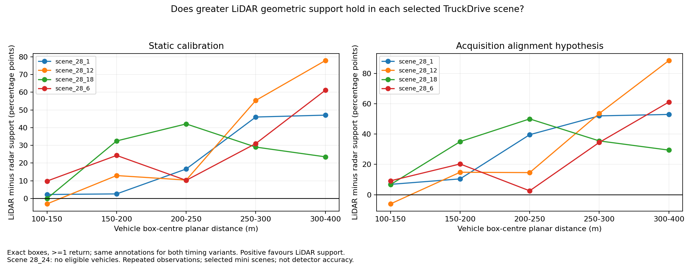

# Long-range LiDAR versus radar: five-scene TruckDrive result

24 September 2026 · Group 7 · EXP-0017 · result 0020

**26 September follow-up:** [class and distance analysis](what-sensors-miss-by-range.md)
extends this study to short range and non-vehicle classes. It finds large thin-object
timing sensitivity and a seven-passenger-track exception to the pooled advantage.
The result below remains specific to its stated pooled vehicle cohort.

## Result to present

**Of five selected TruckDrive mini scenes, four contained sampled vehicle annotations at 200-400 m. LiDAR provided in-box returns for a greater fraction of those vehicle observations than radar in every eligible scene under both timing variants.**

Across **504 vehicle observations from 55 scene-qualified tracks**, exact-box support was **80.36% / 37.50%** with static calibration and **84.72% / 35.52%** with the acquisition-time correction hypothesis (LiDAR / radar). The difference favoured LiDAR in **4 of 4 scenes** for static calibration and **4 of 4** after correction.

This is a completed descriptive result about the released sensor configurations and annotated objects. It supports choosing LiDAR as the stronger source of long-range vehicle geometric support in this subset. It does **not** establish superior detector accuracy, all-weather performance, or a universal physical advantage of LiDAR.

## Data and method

Scene_28_1 is the previously analysed pilot; scenes 6, 12, 18 and 24 are new. We fixed these scene indices before inspecting their support results, then selected 40 evenly spaced annotation timestamps per scene to bound download and compute cost. All five scenes provide 200 annotation frames, but only 40 per scene enter this follow-up. Static output retains 200 sampled frames; the matched comparison below uses **190 frames and 4,306 valid non-ego observations of all classes**. Two boundary frames per scene are removed from both compared variants because acquisition-pose correction would require extrapolation. No selected frame was dropped for a missing sensor stream.

Radar and LiDAR use the same annotation boxes and sync keys. LiDAR combines the released joint Aeva stream and three Ouster streams; radar uses the released joint radar stream. We preserve both static calibration and the filename acquisition-time correction hypothesis. Source frame identities, exclusions, input hashes and transforms are committed with the counts. The corrected timing variant is a sensitivity test, not proof of the publisher's internal deskew.

Four new scenes were downloaded as **selected members of the official ZIP archives**. Each retained member passed its ZIP CRC and has a SHA-256 hash; we did not download or verify each entire archive. All annotation members were retained to interpolate the released ego poses. Camera images and model inference were unnecessary. See the [selection protocol](truckdrive-multiscene-protocol.md).

The timestamp values reset within each clip. These five numbered clips are not claimed to be independent recording sessions, a random sample, or representative of the full dataset. Repeated observations are correlated; scene and track sensitivity are reported instead of treating every box as an independent statistical trial.

## Vehicle support by distance

A supported observation contains at least one recorded return inside the exact released oriented box. Both timing columns use the same observations. Tracks recur across distance bands, so track counts must not be added across rows. The 200-400 m row overlaps the three rows above it.

| Distance | Observations / tracks | Static LiDAR / radar | Aligned LiDAR / radar | Scenes favouring LiDAR: static / aligned |
|---|---:|---:|---:|---:|
| 100-150 m | 309 / 66 | 91.26% / 86.73% | 92.56% / 86.08% | 2/4 / 3/4 |
| 150-200 m | 283 / 65 | 83.75% / 69.26% | 86.22% / 68.90% | 4/4 / 4/4 |
| 200-250 m | 173 / 51 | 78.03% / 58.96% | 80.35% / 53.76% | 4/4 / 4/4 |
| 250-300 m | 166 / 44 | 83.13% / 39.76% | 84.94% / 38.55% | 4/4 / 4/4 |
| 300-400 m | 165 / 33 | 80.00% / 12.73% | 89.09% / 13.33% | 4/4 / 4/4 |
| 200-400 m | 504 / 55 | 80.36% / 37.50% | 84.72% / 35.52% | 4/4 / 4/4 |

The 300-400 m row does not prove radar or LiDAR supports every distance up to 400 m. It aggregates the observed boxes within that interval. Increased percentages in a farther band can reflect which vehicles remain in view rather than improved sensing with distance.



## Each scene at 200-400 m

Scene_28_24 has valid distant annotations of other classes, but no valid vehicle annotations beyond 100 m in the selected frames. It is retained as a zero-eligibility row, not counted as a LiDAR win and not silently replaced with a more favourable scene.

| Scene | Observations / tracks | Static LiDAR / radar | Aligned LiDAR / radar |
|---|---:|---:|---:|
| scene_28_1 | 115 / 10 | 73.04% / 39.13% | 79.13% / 32.17% |
| scene_28_6 | 86 / 16 | 72.09% / 44.19% | 69.77% / 44.19% |
| scene_28_12 | 217 / 19 | 87.56% / 30.41% | 94.01% / 30.88% |
| scene_28_18 | 86 / 10 | 80.23% / 46.51% | 83.72% / 43.02% |
| scene_28_24 | 0 / 0 | No eligible vehicles | No eligible vehicles |

Giving every eligible scene equal weight produces a LiDAR-minus-radar difference of **38.17 percentage points** for static calibration and **44.09 points** for the alignment hypothesis. Removing any one scene leaves the equal-scene difference at least **31.85 / 37.75 points**, respectively. These are sensitivity summaries, not confidence intervals for all roads or sensors.

Giving each track equal weight after averaging its repeated observations yields static: 70.72% LiDAR / 45.08% radar; aligned: 73.41% LiDAR / 45.59% radar. This retains the same direction without letting long-visible tracks dominate.

Using only the first qualifying observation of each track also avoids letting long-visible tracks dominate:

- static: 55 first qualifying track observations; 61.82% / 29.09% (LiDAR / radar).
- aligned: 55 first qualifying track observations; 72.73% / 30.91% (LiDAR / radar).

## Box and return-count sensitivity

All rows below concern vehicles at 200-400 m. Expanding boxes can admit background returns. Three or five returns is a density diagnostic, not a detection-success criterion, and points from different sensor modalities need not contain equal information.

| Timing | Face expansion (m) | Minimum returns | LiDAR / radar | Scenes favouring LiDAR | Equal-scene difference (pp) | Worst leave-one-scene-out (pp) |
|---|---:|---:|---:|---:|---:|---:|
| static | 0 | 1 | 80.36% / 37.50% | 4/4 | 38.17 | 31.85 |
| static | 0 | 3 | 75.40% / 10.91% | 4/4 | 63.17 | 60.58 |
| static | 0 | 5 | 69.25% / 5.36% | 4/4 | 62.33 | 60.21 |
| static | 0.5 | 1 | 86.51% / 50.99% | 4/4 | 28.47 | 19.07 |
| static | 0.5 | 3 | 82.94% / 20.24% | 4/4 | 59.84 | 55.67 |
| static | 0.5 | 5 | 80.36% / 9.33% | 4/4 | 68.07 | 64.18 |
| aligned | 0 | 1 | 84.72% / 35.52% | 4/4 | 44.09 | 37.75 |
| aligned | 0 | 3 | 81.15% / 10.12% | 4/4 | 67.92 | 63.98 |
| aligned | 0 | 5 | 77.98% / 4.76% | 4/4 | 69.36 | 64.37 |
| aligned | 0.5 | 1 | 86.71% / 49.21% | 4/4 | 30.70 | 21.58 |
| aligned | 0.5 | 3 | 84.33% / 19.84% | 4/4 | 61.56 | 57.50 |
| aligned | 0.5 | 5 | 82.34% / 8.73% | 4/4 | 70.25 | 66.02 |

**Exceptions are retained.** Restricting to passenger cars or forward +/-30-degree vehicles can change individual scene conclusions. Negative per-scene differences in those 200-400 m subcohorts are:

- scene_28_6, passenger_cars, static, margin 0 m: 0.00% / 100.00% (LiDAR / radar), 1 observation.
- scene_28_6, passenger_cars, static, margin 0.5 m: 0.00% / 100.00% (LiDAR / radar), 1 observation.
- scene_28_6, passenger_cars, aligned, margin 0 m: 0.00% / 100.00% (LiDAR / radar), 1 observation.
- scene_28_6, passenger_cars, aligned, margin 0.5 m: 0.00% / 100.00% (LiDAR / radar), 1 observation.
- scene_28_6, forward_vehicles, aligned, margin 0.5 m: 72.92% / 75.00% (LiDAR / radar), 48 observations.

The complete pilot also had a slight radar lead at 150-200 m under static calibration (73.58% LiDAR versus 74.96% radar on the matched 198-frame subset). That changed with timing and box expansion. This follow-up's 40-frame sampling can change small differences too; it does not erase the pilot. The defensible headline is the selected **200-400 m aggregate vehicle-support result**, not a claim that LiDAR wins every scene/class/distance combination.

## Radar still contributes information

At 200-400 m, the static comparison has **30 radar-only observations**: radar has an in-box return where LiDAR has none. The aligned variant has **25**. The static counts are 159 both-supported, 246 LiDAR-only, 30 radar-only and 69 neither; aligned counts are 154, 273, 25 and 52, respectively.

The fraction with support from either sensor is **86.31% static / 89.68% aligned**. This is an annotation-conditioned union-of-support diagnostic, not fusion-detector recall. It is a practical reason to investigate radar's complementary cases even though LiDAR has greater aggregate geometric support.

## How this connects to TruckScenes and GOOSE

The earlier TruckScenes vehicle counts give 91.53% LiDAR versus 20.88% radar support at 150-200 m (1,370 observations, nine scenes), and 86.28% versus 0.30% in its 200-250 m band (328 observations, eight scenes; actual maximum 229.42 m). These are [separate existing results](evidence/long-range-cross-dataset/cohort_profiles.csv), not pooled with TruckDrive.

TruckScenes radar recordings show a boundary near 189.52 m in sensor-spherical range. That dataset therefore cannot establish a fair general radar-versus-LiDAR comparison beyond its recorded radar coverage. TruckDrive extends the geometric comparison beyond 200 m with a different platform and recording pipeline. Agreement in direction is supporting context, not a controlled replication with identical hardware and processing.

GOOSE supplies off-road semantic labels and the team's terrain analysis; the current GOOSE workflow does not provide paired radar/LiDAR detection ground truth. It cannot supply a third vote for this vehicle-box result. See the [cross-dataset review](long-range-cross-dataset-review.md) for independently sourced alternatives.

## Limits on the conclusion

- The endpoint is geometric support for known annotations. It does not measure false positives, missed unannotated objects, classification or localization error.
- Labels use camera-based refinement and LiDAR-derived ground information. Annotation selection can affect the comparison; labels are not sensor-neutral experimental truth. [TruckDrive paper, section 3.3](https://arxiv.org/html/2603.02413v1).
- Hardware, field of view, sensor counts, fusion/filtering and point representations differ. A forward-angle restriction does not prove equal field of view or equal occlusion.
- Acquisition correction uses ego motion, not moving-target trajectories or independently reproduced per-point deskew. Keeping both variants exposes this uncertainty.
- No weather-stratified comparison, radar-only detector or matched LiDAR/radar detector benchmark has been run here. The paper's detection table compares camera, LiDAR and LiDAR-camera methods; it is not a radar-only validation of this result. [TruckDrive paper, table 4](https://arxiv.org/html/2603.02413v1).

## Verification and reproduction

- All 25 sensor-to-reference transforms agree with the publisher helper functions to an absolute tolerance of 1e-12.
- **488 selected counts** agree with a full-cloud implementation using explicit sine/cosine box rotation, without the production KD-tree prefilter or inside-box helper. This checks counting, not independent timing validity.
- Every raw input referenced by the ten run manifests was rehashed; selected downloads passed member CRC checks.
- Regression tests cover scene-qualified IDs, matched timing subsets, timestamp-based sampling and the risk that long tracks dominate a pooled percentage.

For each scene in `scene_28_1 scene_28_6 scene_28_12 scene_28_18 scene_28_24`:

```text
python scripts/truckdrive_paired_support.py --scene-root <dataset>/<scene> --frame-count 40 --output-dir docs/evidence/truckdrive-multiscene/<scene>/static
python scripts/truckdrive_paired_support.py --scene-root <dataset>/<scene> --frame-count 40 --align-ego --output-dir docs/evidence/truckdrive-multiscene/<scene>/aligned
```

Then rebuild the tables and figure:

```text
python scripts/truckdrive_multiscene_summary.py --evidence-root docs/evidence/truckdrive-multiscene --scenes scene_28_1 scene_28_6 scene_28_12 scene_28_18 scene_28_24 --output-dir docs/evidence/truckdrive-multiscene/summary
```

Recheck selected counts and all referenced raw input hashes:

```text
python scripts/verify_truckdrive_multiscene.py --dataset-root <dataset>
```

Raw data remains outside Git. The [summary CSV](evidence/truckdrive-multiscene/summary/summary.csv), [per-scene CSV](evidence/truckdrive-multiscene/summary/by_scene.csv), [class CSV](evidence/truckdrive-multiscene/summary/by_class.csv), [first-track CSV](evidence/truckdrive-multiscene/summary/first_per_track.csv) and [verification](evidence/truckdrive-multiscene/verification.json) preserve the denominators and exceptions.

## Decision and next experiment

**Detector follow-up:** the [checkpoint compatibility audit](detector-compatibility-decision.md)
downloaded a published radar/LiDAR model pair, but their embedded input grids end
near 70 m. The 200–400 m detector comparison remains open pending compatible models.

Close the descriptive long-range geometric-support comparison with the qualified result above and present it to the client. More copies of the same point-count experiment are not a substitute for testing perception performance.

The next substantive claim should be whether that geometric-support advantage translates into vehicle detection/localization at 200-300 m. First verify numerical coordinate conversion and establish one runnable LiDAR detector and one radar detector with compatible labels and evaluation. If matched inference is not feasible on the available hardware, keep the result explicitly at the sensor-support level. Independent-dataset replication (for example L-RadSet once accessible) would strengthen generalisation; it is not completed here.
