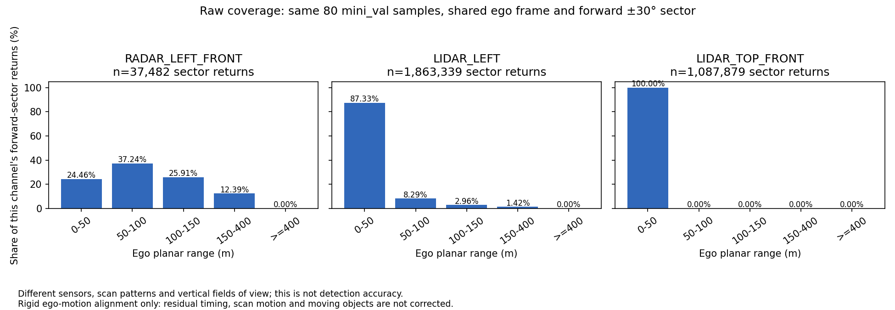
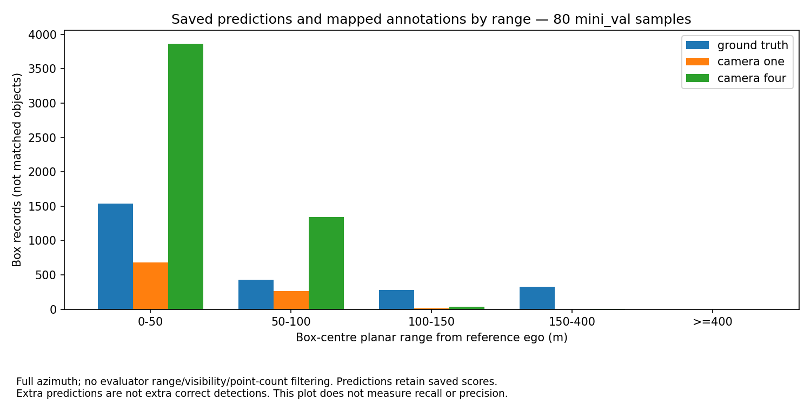

# Raw TruckScenes comparison — 22 September 2026

**The corner LiDAR produces substantial long-range data. The earlier roof-only
comparison does not represent LiDAR generally.** On the same 80 `mini_val`
samples, in a shared ego frame and forward ±30° sector, the corner `LIDAR_LEFT`
has 26,367 points at >=150 m; `RADAR_LEFT_FRONT` has 4,643 returns; the tilted
`LIDAR_TOP_FRONT` has none in that sector. These are separate channel counts,
not detector scores or unique objects. More returns do not mean better detection.

## What was run

- Official MAN TruckScenes v1.2-mini, all 80 annotated samples in the two
  official `mini_val` scenes, verified against both saved camera submissions.
- Three single-keyframe channels: `RADAR_LEFT_FRONT`, `LIDAR_LEFT`,
  `LIDAR_TOP_FRONT`. No accumulated sweeps or sensor fusion.
- Every cloud transformed sensor → acquisition ego → global → reference ego,
  using release calibration and ego poses. This follows the devkit's rigid
  multisweep transform chain, ending in the ego frame rather than a sensor frame.
- Reference pose: nearest recorded ego pose to the annotation timestamp.
  Range: `sqrt(x²+y²)` in that reference ego plane. Bands: [0,50), [50,100),
  [100,150), [150,400), [400,infinity) m.
- A common spatial region: x>0 and absolute ego azimuth <=30°, no height/elevation
  mask. Full-azimuth counts are retained separately. This region does not
  guarantee identical physical fields of view or unobstructed lines of sight.

The maximum difference between selected sensor timestamps is **48.474 ms**.
The nearest reference pose differs from the annotation timestamp by at most
**4.968 ms**. Sensor-to-associated-pose errors are below 5 ms. The script rejects
sensor offsets above 50 ms and pose offsets above 10 ms. It does not interpolate
poses, deskew within scans, compensate moving objects or apply additional cabin
motion corrections. This is a better-controlled coverage comparison, not a
perfectly simultaneous or causally controlled sensor experiment.

## Forward-sector coverage

| Ego range | Radar left front | LiDAR left corner | LiDAR top front |
|---|---:|---:|---:|
| [0,50) m | 9,168 | 1,627,322 | 1,087,872 |
| [50,100) m | 13,960 | 154,414 | 7 |
| [100,150) m | 9,711 | 55,236 | 0 |
| [150,400) m | 4,643 | 26,367 | 0 |
| >=400 m | 0 | 0 | 0 |
| **Own-channel denominator** | **37,482** | **1,863,339** | **1,087,879** |
| **Share at >=150 m** | **12.39%** | **1.42%** | **0%** |



Radar has a larger *proportion* of distant returns, while the corner LiDAR has
more distant points in absolute terms. Both observations depend on sensor scan
patterns and point density. Neither establishes which detects objects better.
The old ten-scene first-sample counts are unchanged; this is a new 80-sample,
two-scene analysis with a different frame and region. It must not be described
as a like-for-like numerical correction of the old totals.

## Camera predictions versus annotations by range

All saved prediction centres and mapped ground-truth annotation centres were
transformed from global coordinates to the same reference ego frame. No
evaluator range, visibility, point-count or bike-rack filtering is applied to
this descriptive table. Saved prediction confidence scores are retained.

| Full-azimuth ego range | Ground-truth boxes | One-camera predictions | Four-camera predictions |
|---|---:|---:|---:|
| [0,50) m | 1,535 | 683 | 3,867 |
| [50,100) m | 432 | 264 | 1,340 |
| [100,150) m | 281 | 12 | 33 |
| [150,400) m | 326 | 0 | 7 |
| >=400 m | 0 | 0 | 0 |
| **Total box records** | **2,574** | **959** | **5,247** |



There are annotations at long range but very few saved camera predictions
there. This identifies a coverage gap worth investigating; it does not measure
recall, precision or a range-dependent accuracy curve. Boxes have not been
matched in this table, and predictions may duplicate physical objects. Temporal
samples and repeat observations are not independent objects or trials.

## Independent rerun of the official camera evaluator

Both saved submissions were rescored against the newly downloaded ground truth
using the unchanged devkit 1.2.0 evaluator. All scoring fields, class APs, error
fields and configuration match the previously committed summaries exactly;
elapsed evaluation time is excluded from that comparison. No inference or
training was rerun, so original per-camera processing provenance remains open.

| Official score (0–1 scale) | One camera | Four cameras |
|---|---:|---:|
| mAP | 0.000000 | 0.004648 |
| NDS | 0.000000 | 0.003830 |
| Scored prediction boxes | 959 | 5,240 |
| Scored ground-truth boxes | 2,088 | 2,088 |

The official class-specific distance filter explains **all 486 removed
ground-truth boxes**, reducing 2,574 to 2,088. Point-count and bike-rack filters
remove none further here. Seven four-camera predictions are removed by the
distance filter. The official evaluator uses global-horizontal distance from
the `LIDAR_LEFT` acquisition ego pose; that convention remains unchanged and
is separate from the reference-ego descriptive panels above.

Stock class ranges end at 75 or 150 m. These reproduced mAP/NDS scores therefore
do not score the >=150 m coverage shown above or diagnose the cause of weak
camera performance. Default/penalty TP-error values for unmatched classes are
not treated as measured localisation errors.

## Reproduction and evidence

Use the installed Python 3.11 devkit environment and the verified data root:

```sh
python scripts/compare_truckscenes_raw.py --data-root <data-root>
python -m truckscenes.eval.detection.evaluate scripts/results_mini_val_fcos3d.json --dataroot <data-root> --version v1.2-mini --eval_set mini_val --output_dir <output>/one --plot_examples 0 --render_curves 0
python -m truckscenes.eval.detection.evaluate scripts/results_mini_val_fcos3d_4cam.json --dataroot <data-root> --version v1.2-mini --eval_set mini_val --output_dir <output>/four --plot_examples 0 --render_curves 0
```

- [Manifest, transforms, timestamps and input hashes](evidence/truckscenes/raw-comparison/manifest.json).
- [Per-sample counts](evidence/truckscenes/raw-comparison/sample_ranges.csv),
  [aggregate counts](evidence/truckscenes/raw-comparison/aggregate_ranges.csv),
  [box counts by class](evidence/truckscenes/raw-comparison/box_class_ranges.csv).
- [Reevaluation comparison](evidence/truckscenes/raw-comparison/reevaluation_check.json),
  [one-camera recomputed metrics](evidence/truckscenes/raw-comparison/recomputed_metrics_one.json),
  [four-camera recomputed metrics](evidence/truckscenes/raw-comparison/recomputed_metrics_four.json).

The recomputed framework summaries retain its original NaN entries for undefined
TP errors; these are not new numeric findings. No new custom detection metric
was introduced. All work ran on CPU using existing packages.

**Next:** review a small set of aligned point-cloud/annotation overlays to check
occlusions and geometry, then assess runnable radar and LiDAR detector baselines
under the same evaluator. The project now has reproducible raw coverage and
reproduced camera scores; it still needs detector outputs to answer radar versus
LiDAR object-detection accuracy. Results from two mini scenes cannot establish
full-dataset or weather robustness.
