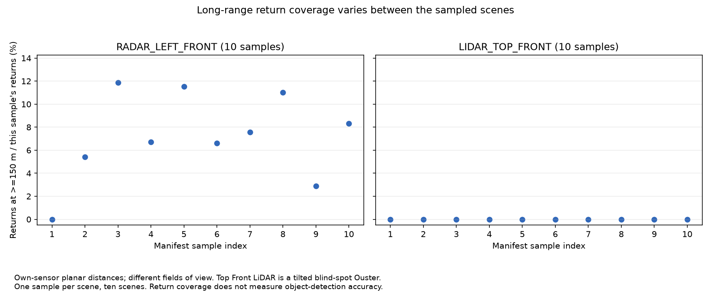
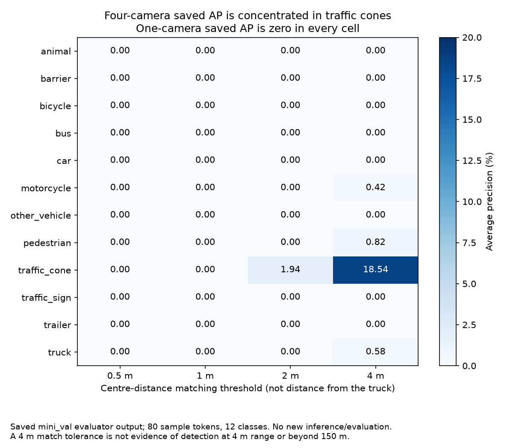

# TruckScenes comparison from saved outputs — 21 September 2026

This starts the comparison work while the integration PR is awaiting approval.
It reanalyses committed outputs; it does not run a new detector, rescore ground
truth or reproduce counts from raw sensor files. Source files are unchanged.

**Follow-up:** the official mini dataset has now been downloaded locally and
the separate [raw-data rebuild](truckscenes-raw-rebuild.md) exactly reproduced
the manifest and range CSV. The saved-output comparisons below are unchanged.

## What we learned

1. **Long-range radar returns recur across the selected scenes.** Nine of ten
   sampled scenes have returns at >=150 m. No single scene contributes more
   than 19.02% of those returns. This is evidence of data coverage in this
   selected channel, not object-detection performance.
2. **More saved camera predictions did not produce a strong score.** The four-camera
   file contains every one of the original 959 boxes, plus 4,288 additional boxes.
   Its reported mAP is 0.004648 on a 0–1 scale (0.4648%). The extra boxes do not
   by themselves establish extra correct detections.
3. **The small AP signal is concentrated in traffic cones and loose matching.**
   All classes have zero AP at 0.5 m and 1 m centre-distance tolerances. At 2 m,
   only traffic cones have nonzero AP. This suggests inspecting cone predictions
   and coordinate conversion first; it does not diagnose camera-height effects
   or prove near-range performance.

## 1. Selected radar and LiDAR coverage across samples

Dataset: MAN TruckScenes v1.2-mini. Scope: first annotated sample from each of
ten scenes, `RADAR_LEFT_FRONT` and `LIDAR_TOP_FRONT`. Measurements use planar
distance in each sensor's own frame; no common ego-frame transform was applied.
The manifest describes shared annotated sample tokens, not proof of identical
sensor capture times. No model or annotation matching is used in these counts.

| Quantity | Selected radar | Selected LiDAR |
|---|---:|---:|
| Available samples | 10 | 10 |
| All returns/points | 4,571 | 165,588 |
| Returns/points at >=150 m | 305 | 0 |
| Samples with at least one return at >=150 m | 9/10 | 0/10 |
| Pooled share at >=150 m | 6.6725% | 0% |
| Median of the ten per-sample shares | 7.1280% | 0% |
| Minimum–maximum per-sample share | 0–11.8852% | 0–0% |

The pooled share weights samples by their number of returns. The median gives
each available sample equal weight; these are different summaries. Every zero
above is a measured count/share with a positive denominator. Missing samples
would be omitted and reported in the available-sample count, not inserted as zero.



The selected LiDAR is a downward-tilted Ouster OS0 blind-spot unit. Sensor
origins, planes and fields of view differ, so **this is not evidence that radar
outperforms LiDAR**. See the [sensor check](../TruckScenes%20-%20Fatima/SENSOR-CHECK.md).
Ten first samples are a convenience subset, not a random population sample;
there is no weather breakdown, whole-scene temporal analysis or significance claim.

## 2. One-camera versus four-camera saved FCOS3D submissions

Dataset/split: MAN TruckScenes v1.2-mini, reported `mini_val`, 12 detection classes.
Both submissions contain the same 80 sample tokens. The experiment records report
the same nuScenes-pretrained FCOS3D checkpoint and CPU environment: no TruckScenes
training. One run uses `CAMERA_LEFT_FRONT`; the other uses all four cameras.
This is a camera-pipeline comparison, not the project's radar/LiDAR benchmark.

| Quantity | One camera | Four cameras |
|---|---:|---:|
| Saved sample entries | 80 | 80 |
| Nonempty entries | 63 | 80 |
| Predicted boxes before evaluator filtering | 959 | 5,247 |
| Saved mAP, 0–1 scale | 0.000000 | 0.004648 |
| Saved NDS, 0–1 scale | 0.000000 | 0.003830 |

The evaluator configurations are identical, including class-specific 75/150 m
range limits and matching thresholds. All four files declare camera-only inputs,
no radar/LiDAR/map/external/future-frame inputs and no test-time augmentation.
The checkpoint identity is reported by the authors; its binary hash, original
run-time configuration and full processing logs were not independently checked.
The runner can prefill empty entries, so 80 keys do not prove all inference
completed. Even nonempty entries do not establish that every requested camera
was processed. No per-camera provenance is stored in individual boxes.

All 959 original box dictionaries are retained exactly in the four-camera file
(field order ignored, duplicate multiplicity preserved). There are 4,288 added
and zero removed boxes. This confirms an extension of the saved output, not an
independent replication or proof that the added boxes are unique physical objects.
The runner concatenates camera predictions; counts are not counts of ground-truth
objects. No retained box had its coordinates or confidence changed between files.



Traffic-cone AP averaged over matching thresholds is 0.051205. As a sensitivity
diagnostic, the unweighted mean AP over the other eleven classes is 0.000416.
That eleven-class mean is **not** the official twelve-class mAP and must not
replace it. The 0.5/1/2/4 m thresholds in the figure are tolerated localisation
errors, not distance bands measured from the truck. Neither saved score measures
performance beyond the stock evaluator's class ranges.

The summaries' default/penalty TP-error values are not treated as measured
localisation errors for unmatched classes. Geometry, calibration, field-of-view
coverage, class mapping and transfer from nuScenes remain possible explanations
for weak scores; this analysis does not isolate their causes.

## Keep the two analyses separate

Only **two** of the ten coverage tokens occur among the eighty camera-submission
tokens. Do not correlate the ten-scene return summary with the eighty-sample
detector score or describe them as one matched experiment. GOOSE and TruckDrive
outputs are also excluded from these numerical panels because their tasks,
subsets and denominators differ.

## Reproduce and inspect

Use the repository's Python 3.11 CI environment (`requirements-ci.txt`):

```sh
python scripts/compare_truckscenes_saved.py
python -m unittest discover -s tests -p test_compare_truckscenes_saved.py -v
```

- [Summary and source hashes](evidence/truckscenes/comparison/summary.json).
- [Per-sample camera box comparison](evidence/truckscenes/comparison/camera_samples.csv).
- [Class AP at each matching threshold](evidence/truckscenes/comparison/camera_class_ap.csv).
- [Per-sample coverage, tokens and denominators](evidence/truckscenes/comparison/coverage_samples.csv).

Source hashes normalize text line endings to LF before hashing UTF-8, so Windows
checkout settings do not change source identity. JSON/CSV outputs are deterministic;
PNG bytes may differ across operating systems because of fonts. Inputs are the
two prediction JSONs, two saved evaluator summaries and the committed range CSV.
No raw dataset, model installation, new inference or new ground-truth evaluation
is required. NaN TP-error fields in the original summaries are not exported as
numeric findings; undefined derived shares are JSON null / blank CSV cells.

## Next comparison to run with the dataset holder

1. Load calibration, poses and sensor timestamps for a fixed shared subset.
   Select a suitable LiDAR channel and overlapping radar field of view, transform
   both into a common ego frame/time and publish new coverage counts under the
   [working protocol](metrics-definitions.md#sprint-3-working-coverage-protocol--21-september-2026).
2. For the camera diagnostic, inspect the traffic-cone predictions alongside
   visible ground truth, then verify one box's camera-to-global transform and
   processing provenance. Only then attempt per-range prediction/truth analysis.
3. A radar/LiDAR **accuracy** comparison still requires runnable detectors,
   identical evaluation inputs and a declared training/model protocol. Current
   return counts cannot substitute for that experiment.
