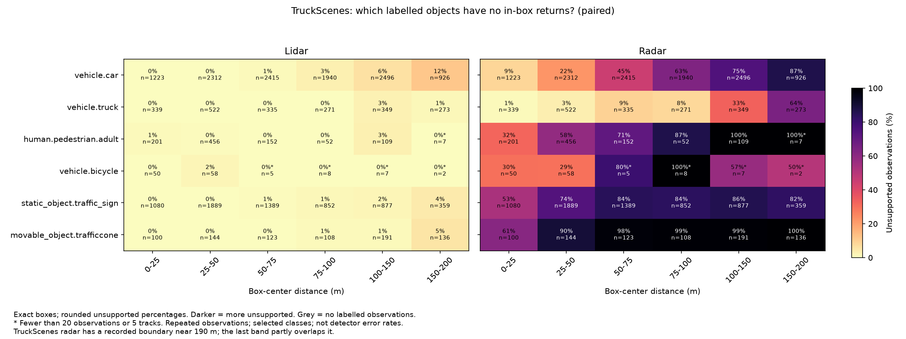
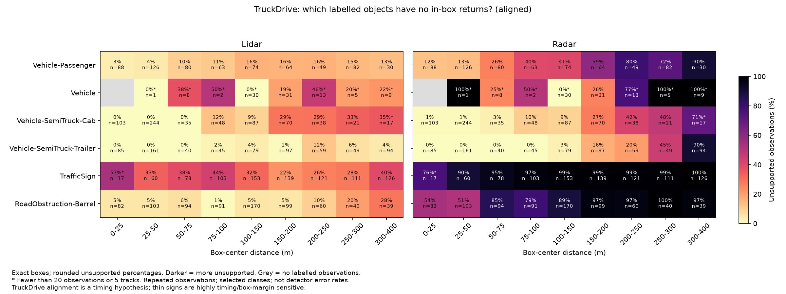
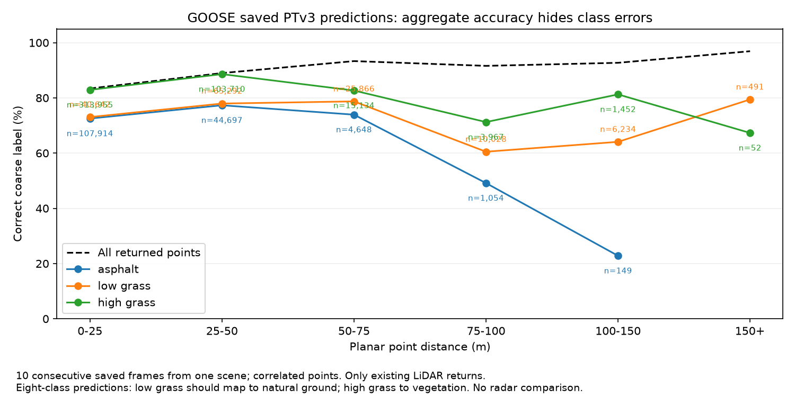

# What is missing at short and long range?

26 September 2026 · EXP-0021 · results 0024–0026

## What our percentages mean

**An 80% support rate means that 80 out of 100 annotated object observations contain at least one recorded sensor return inside their labelled 3D box.** It does not mean a detector correctly identified 80 cars. A car observed in ten frames contributes ten observations. A mixed-class percentage includes whichever classes its denominator specifies, not every object or surface in the scene.

Three different questions must remain separate:

1. **Sensor support:** did any recorded return fall inside the object's box? This study measures this for radar and LiDAR in TruckScenes and TruckDrive.
2. **Recognition:** did a trained model identify and locate the object correctly? This needs predictions matched to ground truth, including missed objects, wrong classes, bad locations and false positives. The object-support tables below do not answer it.
3. **Terrain classification:** was a returned point labelled as the correct type of surface? The saved GOOSE predictions below answer a small part of this question for LiDAR only.

Roads and grass are not part of the vehicle-box denominator. Neither an unsupported box nor an incorrectly classified point proves that an entire physical object or surface is invisible. Returns can fall outside a thin box because of timing, calibration, annotation geometry or motion. Occlusion and sensor coverage also matter; we have not assigned a physical cause to individual misses.

## Study and scope

We reuse the previously verified paired object counts: **25,117 observations over 389 TruckScenes frames** and **4,306 non-ego observations over 190 matched TruckDrive frames** from five selected scenes. Native classes stay separate. TruckScenes retains its native `vehicle.ego_trailer` category in the all-class exports; it is not included in the selected-class examples. These are released sensor configurations, with multiple sensors combined as documented in the earlier studies, not a controlled hardware comparison.

The script exports all available classes in nine planar box-center distance bands, exact boxes and boxes expanded by 0.5 m per face. TruckDrive retains static and acquisition-time-aligned hypotheses on identical observations. It also follows scene-qualified tracks that appear in both a nearer and farther band, averaging within each track before averaging across tracks. This reduces changes in object identity; it does not control viewpoint, occlusion, motion or label quality.

No new detector inference was run. A separate CPU analysis scores ten existing GOOSE PTv3 prediction files from the interrupted August run. These consecutive frames all come from `2022-07-22_flight`; their 1,785,024 points are correlated, not millions of independent trials.

## TruckScenes: short-range support already differs by class

Each cell gives **LiDAR / radar support**, followed by observation count in brackets. These are exact-box, paired, motion-corrected counts. Track counts and all intermediate distance bands are in the [class table](evidence/missing-support/class_support.csv).

| Labelled class | 0–25 m | 25–50 m | 100–150 m |
|---|---:|---:|---:|
| Cars | 100.0% / 91.5% [1,223] | 99.7% / 78.1% [2,312] | 94.0% / 25.2% [2,496] |
| Trucks | 100.0% / 99.1% [339] | 100.0% / 96.7% [522] | 97.4% / 67.0% [349] |
| Adult pedestrians | 99.0% / 67.7% [201] | 99.6% / 41.7% [456] | 97.2% / 0.0% [109] |
| Traffic signs | 99.9% / 46.9% [1,080] | 99.9% / 26.0% [1,889] | 98.2% / 14.1% [877] |
| Traffic cones | 100.0% / 39.0% [100] | 100.0% / 10.4% [144] | 99.0% / 1.0% [191] |

The radar support decline is not simply “fewer cars”: cones, signs and pedestrians already have less exact-box support than trucks at short range. At 100–150 m, radar supports a much larger fraction of trucks than cars. The zero for distant pedestrians concerns **109 repeated observations of 13 tracks**, not proof that radar cannot detect people at that distance. Labels may favour LiDAR-visible objects.

For **237 car tracks present in both 0–50 m and 50–100 m**, equal-track mean LiDAR support changes from **99.8% to 98.6%**, while radar changes from **80.0% to 52.5%**. Thus, changing car identities alone does not explain that particular decline. This remains an observational comparison.



The plot shows **unsupported** percentages, the complement of the table. The recorded TruckScenes radar cloud has a boundary near 190 m; the 150–200 m band partly overlaps that boundary. We do not use its beyond-200 m zeros to claim a fair long-range modality comparison. All exported bands remain available for auditing.

## TruckDrive: vehicles, roadwork objects and signs behave differently

This table uses the **acquisition-time alignment hypothesis, exact boxes**. The hypothesis is a sensitivity test, not verified publisher deskew. All static results are retained alongside it.

| Labelled class | 0–25 m | 100–150 m | 300–400 m |
|---|---:|---:|---:|
| Passenger vehicles | 96.6% / 87.5% [88] | 83.8% / 59.5% [74] | 86.7% / 10.0% [30] |
| Semi-truck cabs | 100.0% / 99.0% [103] | 90.8% / 90.8% [87] | 64.7% / 29.4% [17] |
| Semi-truck trailers | 100.0% / 100.0% [85] | 96.2% / 97.5% [79] | 95.7% / 9.6% [94] |
| Roadwork barrels | 95.1% / 46.3% [82] | 94.7% / 11.2% [170] | 71.8% / 2.6% [39] |
| Traffic signs | 47.1% / 23.5% [17] | 68.0% / 1.3% [153] | 60.3% / 0.0% [126] |

Support does **not** necessarily decrease in every successive band. The sampled objects, views and number of repeated observations change. The 17-observation cells are particularly small. At 75–100 m, radar slightly exceeds LiDAR for cabs (**89.6% versus 87.5%**, 48 observations) and trailers (**100% versus 97.8%**, 45 observations).



### An important measurement sensitivity

For the same 153 sign observations at 100–150 m:

| Geometry assumption | LiDAR support | Radar support |
|---|---:|---:|
| Static, exact boxes | 14.4% | 1.3% |
| Static, +0.5 m boxes | 66.0% | 17.0% |
| Aligned, exact boxes | 68.0% | 1.3% |
| Aligned, +0.5 m boxes | 81.7% | 32.7% |

Similarly, LiDAR support for the 170 barrel observations at 100–150 m changes from **28.8% static to 94.7% aligned**. These changes are too large to describe every exact-box miss as physical inability to see an object. Expanded boxes can also collect background returns. We need a frame overlay and timestamp/calibration check before giving these misses a cause. The very different sign results in TruckScenes and TruckDrive are not an isolated hardware effect: the datasets' labels, acquisition and scenes differ.

### A counterexample to a universal LiDAR advantage

Only **seven passenger-vehicle tracks across three scenes** appear in both 100–150 m and 200–400 m. Giving each of those tracks equal weight:

| Assumption | Near LiDAR / radar | Far LiDAR / radar |
|---|---:|---:|
| Static, exact | 58.3% / 50.0% | 19.3% / 47.1% |
| Aligned, exact | 70.2% / 54.8% | 27.9% / 50.0% |
| Static, +0.5 m | 82.1% / 61.9% | 53.6% / 52.9% |
| Aligned, +0.5 m | 89.3% / 66.7% | 50.7% / 55.7% |

This is a small selected subset, and its ranking is margin-sensitive. It nevertheless prevents us from saying LiDAR wins for every class or every tracked object. The [earlier pooled five-scene vehicle result](truckdrive-multiscene-result.md) remains valid for its stated cohort; it does not settle this narrower same-track question. See [all matched-track summaries](evidence/missing-support/matched_track_summary.csv) and [individual track rows](evidence/missing-support/matched_tracks.csv).

## GOOSE: what a model actually misclassifies

GOOSE provides a different, complementary result. Here we compare saved PTv3 predictions against labels on **existing LiDAR points**. The model predicts eight coarse classes. Fine labels such as asphalt and grass are used to inspect errors, but this is **not** a 64-class model evaluation: asphalt should map to artificial ground, low grass to natural ground, and high grass to vegetation. Sky is mapped to other, matching the original loader. All ten remapped label files were checked against the challenge labels used for the original run.

| Ground-truth surface | Correct coarse label at 0–25 m | At 75–100 m | At 100–150 m | Most common wrong coarse label in these bands |
|---|---:|---:|---:|---|
| Asphalt | 72.5% [107,914 points] | 49.1% [1,054] | 22.8% [149] | Natural ground |
| Low grass | 73.1% [40,642] | 60.5% [10,028] | 64.1% [6,234] | Vegetation |
| High grass | 82.9% [313,955] | 71.2% [3,967] | 81.3% [1,452] | Natural ground |

For the 149 asphalt points at 100–150 m, **34 receive the correct artificial-ground label and 96 are predicted as natural ground**. That means misclassification of returned points, not 115 completely unseen roads. The distant asphalt sample is tiny and cannot establish general long-range road accuracy.



Aggregate eight-class point accuracy actually rises from **83.4% at 0–25 m to 96.9% beyond 150 m**, while specific classes show substantial errors. Beyond 150 m, **29,785 of 31,438 points (94.7%) are vegetation** and there are no artificial-ground points. This explains why the aggregate alone cannot answer “what is missing?”; it does not demonstrate that the model improves with distance. This partial, single-scene diagnostic is not a full GOOSE benchmark or a radar/LiDAR comparison.

The [full confusion counts](evidence/missing-support/goose-saved/confusion.csv) include all eight classes, including wrong predictions into a class. The [fine-label error table](evidence/missing-support/goose-saved/raw_class_errors.csv) gives class-conditioned correctness and the most frequent wrong label. Road/grass **coverage** would require an independent surface-visibility denominator; these files only assess returned points.

## Result to present and next work

**In the analysed data, missing sensor support depends on object class as well as distance. Radar retains strong support on nearby large vehicles, while signs, cones, pedestrians and roadwork objects often have less support. LiDAR has stronger pooled distant-vehicle support in the selected TruckDrive scenes, with class/track exceptions and substantial timing sensitivity for thin objects. Separately, saved GOOSE predictions show terrain-label confusion that aggregate accuracy hides. None of these results establishes universal sensor superiority or matched detector accuracy.**

The most useful next steps are:

1. Render paired points and boxes for a small fixed set of near/far cars, thin signs and barrels, including the seven-track exception. Check both timing hypotheses, field of view, occlusion and background contamination. Label physical causes as unresolved unless the visual/timing evidence supports them.
2. For recognition errors, use compatible pretrained radar and LiDAR models in a declared common region, then count missed ground-truth objects, wrong labels, location errors and false positives by class and distance. Start where both checkpoint input regions actually overlap; a successful one-frame model run alone is not an accuracy comparison. See the [compatibility audit](detector-compatibility-decision.md).
3. For terrain, expand prediction evaluation across scenes only when the compute budget is agreed. Keep it as a separate LiDAR segmentation question; STONE remains parked under the existing project decision. GOOSE cannot supply the missing paired radar comparison with the assets used here.

## Reproduction and checks

Install the repository's existing `requirements-ci.txt`; no new dependencies were added.

```powershell
python scripts/analyse_missing_support.py
python scripts/analyse_goose_saved_errors.py --root <GOOSE-validation-root> --predictions <saved-run>/result --mapping <GOOSE-archives>/challenge_label_mapping.csv
python -m unittest discover -s tests -v
python scripts/validate_result.py
python scripts/validate_experiment_logs.py
```

The first command uses committed count tables, with hashes in its [manifest](evidence/missing-support/manifest.json). The second requires local raw GOOSE scans, labels, challenge labels and saved predictions; hashes and frame identities are recorded in its [manifest](evidence/missing-support/goose-saved/manifest.json). Raw data and prediction arrays are not redistributed here. The committed tables are sufficient to inspect all reported results.

[Verification](evidence/missing-support/verification.json) checks support partitions, class aggregation, GOOSE frame/band totals and agreement of all ten recomputed frame accuracies with the original log to its four-decimal precision. Tests cover zero-return denominators, track pairing, distance boundaries, label changes and confusion-matrix orientation/invalid inputs. No new GPU inference or simulated measurements were used.
